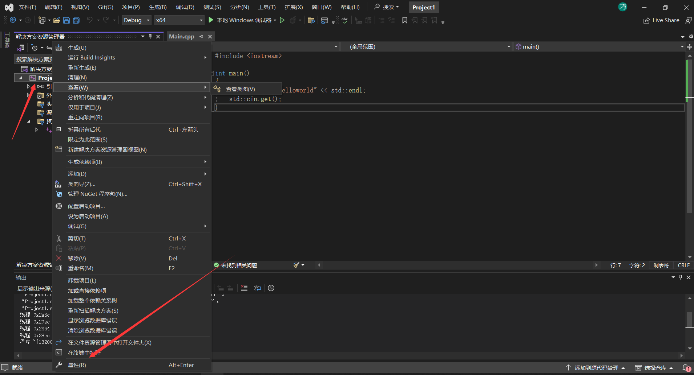
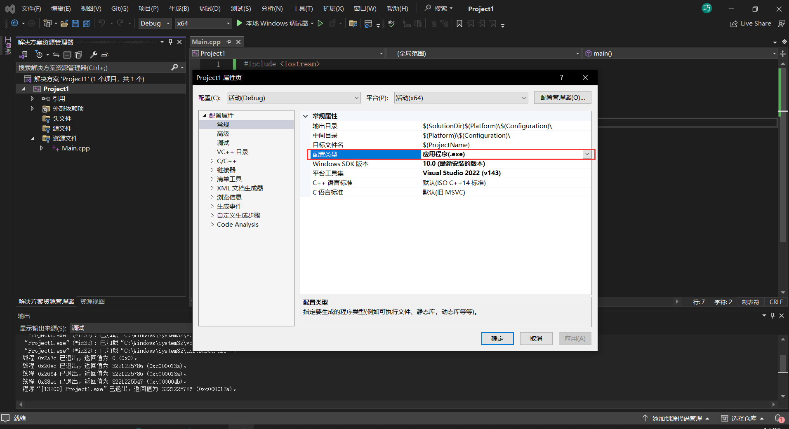
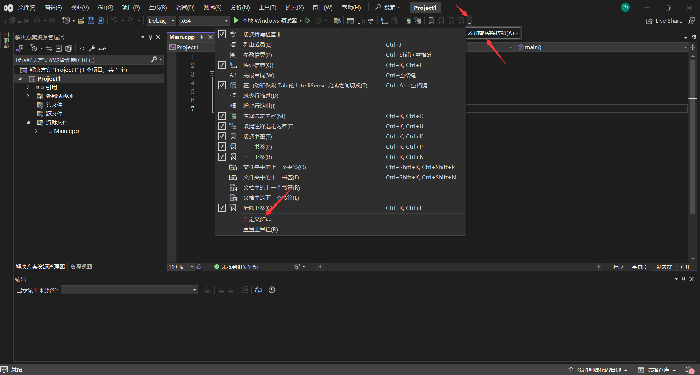

# 1、

可以修改需要运行的平台，比如32位或64位处理器。也可以更改生成的文件，比如说exe或者bin。






# 2、

编译单独cpp文件，这的输出错误信息更多更准确



# 3、

编译前先进行预处理preprocessor，每一个cpp都会编译成obj，通过拦截器linker 链接成exe或bin 

#include 就是将文件拼接起来，相当于把文件这个文件的内容复制进去

#define 就是将内容替换

#if #endif 就是预处理判断，如果if后为真，则加载代码块，否则不加载

任何常量都可以在编译时计算出来，无需在运行时计算

# 10、

头文件的#program once 是防止在一个翻译单元，即cpp文件引入过多次该头文件。比如说不同的翻译单元引入同一个头文件，但这些翻译单元又互相引用对应的头文件，导致会过多的头文件别复制到不同的位置。

或者使用c语音的 #ifdef  #define <  .h>  #endif 。如这个例子，如果 _LOG_H 这个头文件即 define 定义过的，被加载过，则不再加载下列代码块。

include后使用 " "或 <> 的区别是 <> 是相对于编译器的路径， " "是相对于项目的相对路径，包括编译器。故使用 " "会更好

```
eg.
#ifdef _LOG_H
#define _LOG_H

#endif
```

# 13、

可以修改目录结构，使结构更清晰。-> 项目的属性，

# 17、

引用：将一个变量以另一个名称来表示。可以用于与传递指针相同的功能。

eg.

```
int a = 10;
int&  ref = a;

// 这样使用add函数，无需传入a的指针，也可以直接对a的值进行操作。
add(a);
void add(int& value){
	value++;
}
```

# 18、类

跟java中的类类似。可以直接使用类.成员进行访问，但是，如果不是public，则外部不能访问成员变量。

eg.

```
class Player{
public:
	int x,y;
	int speed;
	void Move(int ax, int ay){
		x = ax;
		y = ay;
	}
};

int main(){
	Player player;
	palyer.move(1,2);
}
```

# 19、结构体

结构体跟类相似，可以直接将类class改为struct，这样也是可以的。但是结构体默认的访问是公共的。

eg.	仅有类型声明不同，调用等都相同

```
struct Player{
	int x,y;
	int speed;
	void Move(int ax, int ay){
		x = ax;
		y = ay;
	}
};

int main(){
	Player player;
	palyer.move(1,2);
}
```

# 21、static

被static声明的全局类或全局变量，作用域只有在本编译单元，其他编译单元要引用会失败，如extend。

静态方法不能访问非静态的成员变量

```
class Player{
	int x,y;
	static void Move(){
		std::cout << x << y << std::endl; 
	}
}
```

可以在一个方法里使用静态变量，这样每次调用这个方法就不会每次都创建一个变量，而是沿用第一次创建的变量

```
void Move(){
	static Player player;
	std::cout << player << std::endl;
}
```

# 24、枚举

 枚举本质上是整数，默认从第一个开始是0，一次递增。也可以给枚举类限制类型。在类中，可以直接使用这个枚举里的变量。但类中的枚举没有命名空间。

```
enum Level [: char]
{
	LevelError = 0,LevelWarning,LevelInfo
}
```

# 25、constructor构造函数

跟java的构造函数相似，直接使用类名进行初始化。可以传入参数进行初始化

```
class Player
{
public:
	int x,y;
	Player(){
		x = 0;
		y = 0;
	}
	player(int ax, int ay){
		x = ax;
		y = ay;
	}
}

int main(){ 
	Player player(2,3);
	std::cout << player.x << std::endl;
}
```

# 26、destructor析构函数

与构造函数相反，在类前加波浪号 ~

```
class Player
{
public:
	int x,y;
	Player(){
		x = 0;
		y = 0;
	}
	~player(){
		std::cout << "destructor!!" << "\n";
	}
}

int main(){ 
	Player player(2,3);
	std::cout << player.x << std::endl;
}
```

# 27、多态

与java相似，c++可以通过继承某个类从而继承这个类的成员

```c++
class Entity
{
public:
	int x,y;
    Entity(){
        x = 0;
        y = 0;
    }
    void Move(int ax, int ay){
        x = ax;
        y = ay;
    }
}

class Player: class Entity
{
public:
    const char * name;
    void print(){
        std::cout << x << y <<"\n";
    }
}
```

# 28、虚函数

在某个函数前添加virtual，在重写的函数后加override。与java的抽象类相似，但c++的virtual可以有本身的代码块。

```
class Entity{
public:
	virtual std::String GetName() {
		return "Entity";
	}
}
class Player : public Entity{
private:
	std::string m_name;
public:
	Player(const std::string& name)
		: m_Nmae(name){}
	std::string GetName() override {
		return m_name;
	}
}
```

# 29、纯虚函数

在c++中没有接口这一个类型，但是，有纯虚函数的习惯称之为接口。继承了接口的类必须要实现其纯虚函数。纯虚函数的表示是给虚函数赋一个0；

```c++
class Privabil
{
public:
    virtual std::string GetName() = 0;
};
class Entity : public Privabil
{
public:
	std::string GetName() override { return "Entity"; }
};
class Player : public Privabil
{
public:
    std::string GetName() override { return "Player"; }
};

void Print(Privabil* obj){
        std::cout << obj->GetName() << "\n";
}
int main()
{
        Entity* en = new Entity();
        Player* pl = new Player();
        Print(en);
        Print(pl);
}
```

# 30、控制访问

与java相似，c++分别有public、protected、private三种访问控制。分别是公用，保护，私用。private只能自己类访问，protected能够子类使用。

# 31 、数组

在c++中，可以通过添加头文件array来使用数组

```
#include<array>
// 创建一个名字为arr，长度为4，类型为int的数组。
std::array<int,4> arr;
```

# 33、string

有一个库可以对string进行很好的操作

```
using namespace std::string_literals
```

如：R表示无视换行。如果不加R，需要将字符串连接起来

```
const char * name = R("hello
					test");
```


# 34、const

使用const修饰的变量称为常量，不能改变。

使用const修饰类中的方法成为常方法，其中不能改变方法成员的值。

使用const修饰指针。可以把const放两个位置，一个放在星号前，一个放在星号后。const放在星号前代表着是一个常量指针，地址可以变，但是不可以通过读指针的方式改变值。const放后面表示是一个指针常量，可以通过读读指针修改值，而不能修改指针的值。

如果一个函数的参数带有const，而且这个参数是一个类，那么只能访问其常方法，即带const的方法。

```c++
const char * name = "qiusuyang";

class Entity
{
private:
    int x,y;
public:
    int GetX(){			// 可行
        x = 2;
        return x;
    }
    int GetX() const{	// 可行，但不能修改x的值
        return x;
    }
}

int hel = 20;
const int* var = new int;
str = &hel;				// 可以
*str = 20;				// 不可以

int* const var = new int;
str = &hel;				// 不可以
*str = 20;				// 可以

void Get(const Entity& e){				// 调用的是带const的方法，而不是不带const的
    std::cout << e.GetX() << endl;
}
```


# 内联函数-inline

相对于define，在编译时将函数调用处替换为函数体，==频繁使用== 的 ==简单函数== 可以使用内联函数。

```c++
inline void print(char *s){
	printf("%s",s);
}
```

# volatile

为了让编译器每次都获取变量的值，而不会被优化，使用的关键字。

```
// 该段程序可能在等待其他程序将flag变为1，从而执行do2().但是编译器不知道flag的值会被其它程序改变而进行优化，将flag的值存入寄存器中，然后等待寄存器的值发生变化。但是寄存器的值不能被中断服务改变，所以可能导致死循环。
// 所以此处应该使用 volatile short flag来声明
short flag;
void test(){
	do1();
	while(flag == 0);
	do2();
}
```

