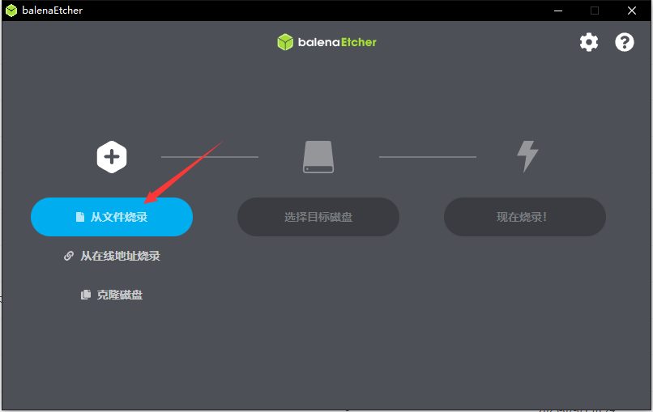
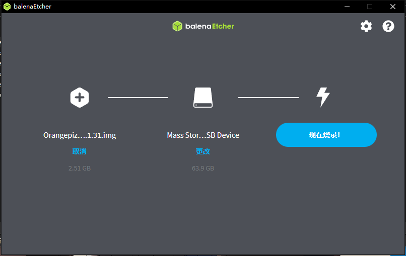

# vmware安装

安装vmtools

```shell
sudo apt install open-vm-tools-desktop -y
```


# 基础命令：

```shell
#	访问url
curl [url]		//相当于访问一个url
				
iostat			//查看硬盘读写
df 				//查看硬盘使用率
scp				//以ssh协议传输文件
ps -ef			//查看当前运行程序（全格式）
		-->aux		//所有进程信息
pstree			//查看进程树
		-->p	//显示进程号
		-->u	//显示用户
vim		-->set nu/nonu	//显示/不显示行数
		-->u		//撤回
		-->set paste 	//粘贴模式
		-->yy 		//拷贝当前行
		-->p		//粘贴
		-->dd		//删除当前行
		-->/[]		//查找
		-->[数字] 再打shift+g	//跳到某行
		
// 定时任务
crond		//定时任务，***** 对应 分时天月周
		1.-->vim my.sh
		2.-->chmod 755 my.sh
		3.-->crontab -e
at			//一次性定时任务
		-->eg. at 5pm + 2day	//两天后的下午五点
		-->atq		//查询任务
		-->atrm		//删除任务
		
// 挂载硬盘-->重启失效
lsblk				//查看硬盘分区
fdisk /dev/sdb		//分区硬盘
		-->n-->p-->w
		-->分区好后进行格式化
mkfs.ext4 /dev/sdb		//格式化dev下的sdb硬盘
mount /dev/sdb /newdir		//将sdb的硬盘挂载到newdir文件夹下
umount	/dev/sdb 或者 /newdir		//将挂载删除
-->永久挂载-->修改/etc/ftable，将uuid与路径对应即可
-->mount -a立即生效

du -hac --max-depth=1 /			// 查看/目录下深度为1的磁盘使用率，h带单位，a含文件，c汇总值
wc -l					//计数
tree 					//以树状图查看目录

#	查看主机名
hostname

#	设置环境变量
export [变量名]=[值]		// 或者进入/etc/profile最下面添加
source /etc/profile

#	统计
uniq -C

#	排序
sort -nr	--> nr 表示从大到小，不写参数默认小到大

#	分割
cut -d '[分隔符]' -f n		 -->n表示取分割出来的第几个，不能分割#空格
awk -F " " '{print $5}'		--> 按空格分割，并打印第五个

#	查看 最前或最后
head -[n]
tail -[n]		// 默认10条

#	文件加锁解锁
chattr +/-i /home/bohe		// 给文件加/减锁，所有用户都不能给文件添加所属用户

#	端口占用
netstat -tunlp

#	选择输出
grep -r	" " /home/bohe				// -r 是递归

#	统计
wc -l				// 统计数量
xargs wc -l			// 统计文件行数

#	查看系统相关-系统版本-系统架构等
lsb_release -a
uname -a
```

## 网络：

```
// 查看ip
U：ifconfig
c：ipconfig

// 防火墙
firewall-cmd --permanent --add-port=[端口]/[协议]			// 开启
firewall-cmd --permanent --remove-port=[端口]/[协议]		// 关闭
firewall-cmd --reload									  // 重新加载
firewall-cmd --query-port=[端口]/[协议]						// 查看是否开放

// 测试某端口是否开放
telnet [端口]

// 查看网络
netstat		--> an(排序)
		    --> p(显示进程)

// 修改固定ip：
#vim /etc/sysconfig/network-scripts/ifcfg-ens33
修改：
4 BOOTPROTO="static"
增加：
IPADDR=				//ip
GATEWAY=			//网关
DNS1=				//域名解析
===更新
service network restart

// 修改hosts
vim /etc/hosts


```

## 运行级别：

```
systemctl get-default					   //查看运行级别
systemctl set-default multi-user.target		//级别3
systemctl set-default graphical.target		//级别5
```


## 服务：

```
systemctl list-unit-files			//查看自启动程序
systemctl enable					//设置自启动
systemctl disable					//设置不自启动
systemctl is-enable					//查询是否自启动

```

## 监控：

```
top 	// 参数
		--> d(秒数) 
		--> i(不显示闲着/僵死进程)
		--> p(通过id来监控某个进程)
		// 命令
		==> P( cpu排序 )
		==> M( 内存排序 )
		==> N( PID排序 )
		==> K( kill某个pid进程 )
		==> u( 监控某个用户 )
		
```

## 软件包：

rpm 与 apt / yum 区别：apt基于rpm，从远程服务器下载并自动处理依赖关系

```
rpm		--> q(查看是否安装)
		--> i(查看信息)
		--> l(包含文件)
		--> f(查看文件归属于哪个软件包)
		--> e(删除)
		--> ivh(安装/提示/进度条)

apt		--> list(查看服务器有的软件)
		


```

## 解压

```c++
gzip [-d]	// 压缩 [解压] 为 gz 后缀文件，-r 压缩目录
unzip		// 解压 zip 后缀文件
```


# 脚本：

有些是dash写法，不支持bash，解决方案：要么换成dash写法，易移植，要么修改默认  sudo dpkg-reconfigure dash ->选择no；或者直接使用  bash -n xxx.sh

```shell
### 开头以 #!/bin/bash 开头，需要有运行x权限或 sh [脚本] 这样无需权限
eg.
==================
#!/bin/bash
echo "hello world!"
==================
 
### shell变量
#	'='不能有空格，使用'$'来使用变量，使用 反引号' ` '或'$()'使用指令
eg.
========================
A=100                   || 设置变量
echo A=$A               || 使用变量
echo "A=$A"             || 
unset A                 || 撤销变量
readonly B=2            || 静态变量，不能被unset
========================

### 注释
========================
: <<!				  || #注释开始
注释内容			   ||
!	                   || #注释结束
========================

### 位置参数
#	使用'$n'来获取执行脚本的参数，其中'n'代表数字，0代表本身，10以上的需用{10}来表示
eg.
./my.sh 1 2
=========================
#!/bin/bash				|| 
echo num0=$0			|| #第一个参数，相当于sh的名称
echo num1=$1			|| 
echo num2=$2			||	
echo all=$*/$@			|| #全部参数，除了第一个，'*'把参数当整体，'@'把参数区分对待
echo num=$#				|| #获取参数个数
=========================

### 预定义变量
#	以设好的变量
eg.
========================
#!/bin/bash			    ||
echo "pid = $$"			|| #当前进程pid
/home/bohe/my.sh &		|| #后台运行
echo "最后一个后台：$!"   || #最后一个后台运行的pid
========================

### 运算符
#	$((运算试))或 'expr'后跟运算试，需要添加反点。$[运算试] 也行，但是默认使用dash。
eg.
========================
`expr m - n`		   || #m-n
$(( n+m ))			   || #n+m
========================

### 条件判断
#	使用if[]或者'[]'来判断，then为块，fi结尾，elif是else。使用时[]中必须有空格。[]中为空是false，为hspEdu是真。
#	1、常用判断
#		=(字符串比较)
#		-lt(小于)	-le(小于等于)  -eq(等于)  -gt(大于)  -ge(大于等于)  -ne(不等于)
#	2、文件判断
#		-r(读权限)  -w(写权限)  -x(执行权限)  -f(存在并是常规文件)  -e(存在)  -d(存在且是目录)
eg.
=====================================
[ "ok" = "ok" ] && echo "相等"	   || #&&表示条件为真执行的语句
if [ "ok" = "ok" ]				    || #判断是否相等，需要有空格分离
then				   			   || #成功执行语句
	echo "相等"		  			  || 
fi					   			   || #结尾
if [ 23 -ge 32 ]			    	|| #23是否大于或等于32
if [ -f /home/bohe ]		         || #文件bohe是否存在
=====================================

### 选择 ***
#	case $变量名 in，以esac结尾。
eg.
========================
case $1 in		       || #位置参数
"1")				  || #等于1
	echo "1";;         || #执行语句，以;;结尾
"2")				  || 
	echo "2";;         ||
*)				      || #不符合其上的其他
	echo "other";;	   ||
esac				  || #结束
========================

### 循环 ###
#	for i in "[值]"，使用do，done区别代码块
#	for((i=0; i<=100; i++))	方法2，默认dash。
eg.
================================
for i in "$@"		   		  || #for循环
do					 	     || #代码块开始
	echo "$i"           	  || #程序
done                    	  || #代码块结束
SUM=0						||
for (( i=0; i<=100; i++))	  || #方法2，前面有空格分开，最后一个不能有空格
do							||	
	SUM=$(( SUM + i ))		 || #执行程序？赋值语句的变量不需要使用'$'
done						||
================================
#	while [ 表达式 ]，使用do，done区分代码块。注意空格
eg.
================================
i=0                             || 
while [ $i < 10 ]			   || #[]里放表达式，注意空格
do                              ||
	echo "i = $i"               ||
	i=$(( i+1 ))			   ||
done						  ||
================================

### 获取控制台输入 ###
#	read 参数有p，阻塞等待输入；t，等待输入的时间
eg.
================================
read -p "请输入num=" NUM1		|| #将控制输入的值赋给NUM1
echo "输入的num = $NUM1"		|| 
read -t 10 -p "输入num2=" NUM2  || #在十秒内输入
================================

### 系统函数 ###
#	basename {path} {suffix} ，返回完整路径最后'/'的部分，suffix为删除后缀
eg.
================================
basename /home/bohe/my.sh .sh   || #结果为'my'
================================
#	dirname {path} ，功能与basename相反，只有路径
eg.
================================
dirname /home/bohe/my.sh		|| #结果为/home/bohe
================================

### 自定义函数 ###
#	function [方法名] {}，调用直接 方法名 参数
eg.
================================
function get(){				   || #定义函数
	SUM=$(( $n1+$n2 ))          || #代码块
	echo "sum = $SUM"           || 
}				               ||
read -p "输入n1：" n1			 || #动态输入
read -p "输入n2：" n2			 ||
get $n1 $n2					   || #调用函数，并传入参数
================================

### 综合实例 ###
#	备份数据库，压缩，并查看10天前是否已有备份
eg.
=======================================================================================
#!/bin/bash																		 ||
BACKUP=/home/bohe/backup														  || #设置备份路径
DATETIME=$(date +%Y-%m-%d_%H_%H_%S)												   || #获取当前时间
echo "备份时间：$DATETIME"														  || 
HOST=localhost																	 || #连接的数据库主机
DB_USER=root																	 || #用户
DB_PW=123456																	 || #密码
DATEBASE=test																	 || #数据库名
[ ! -d "${BACKUP}/${DATETIME}" ] && mkdir -p "${BACKUP/$DATETIME}" 					  || #判断是否存在路径，否则创建
mysqldump -u${DB_USER} -p${DB_PW} --host=${HOST} -q -R --datebases ${DATEBASE} --->	   || #备份数据库操作，
--->|gzip > ${BACKUP}/${DATETIME}/$DATETIME.sql.gz									|| #并打包到指定目录下
cd ${BACKUP}																	 || #转到目录
tar -zcvf ${DATETIME}.tar.gz													  || #将目录打包
rm -rf ${DATETIME}																 || #删除目录
find ${BACKUP} -atime +10 -name "*.tar.gz" -exec rm -rf {} \;						 || #将十天前的备份删除
========================================================================================


```

# 日志：

### 日志服务

日志文件通常放在 '/var/log/' 目录下


日志管理服务 'rsyslogd' 。配置文件是 '/etc/rsyslog.conf'

```
// 添加自定义日志文件，在配置文件中添加
*.*			// 日志格式，第一个 '*' 是图一，第二个 '*' 是图二
如：
corn,kern.eer		/home/bohe/log		// 表示将时间任务，内核相关的错误日志存放在/home/bohe/log文件
```


### 日志轮替：

文件为：/etc/logrotate.conf 。可以进行全局配置，也可以给单独日志进行配置，配置规则如下，也可以通过引入方式进行配置

```
/var/log/secure{		 		// 给单独日志配置
	weekly
}
#include /etc/logrotate.d		// 通过引入配置，这是个文件夹，里面的配置文件需按照上面方法来配置
```


### 内存日志

```shell
#	命令
journalctl	 --> -n 3		 #最近三条
			--> -p err		#错误相关
			--> --since [时间] --until [时间]	#查看两个时间的日志
			--> -o verbose	#详细内容		
```


# 修改默认apt源

先备份原apt源，防止出现意外

```
sudo cp /etc/apt/sources.list /etc/apt/sources.list.bak
```

将源地址清空，换成新地址，镜像使用清华大学镜像站：[清华大学镜像站](https://mirrors.tuna.tsinghua.edu.cn/help/ubuntu/)

```
echo '' > /etc/apt/sources.list
vim /etc/apt/sources.list
// 再将镜像粘入，粘入后需要更新apt源
sudo apt-get update
```

```shell
# 自动脚本 -ubuntu_22.04 LTS版本
#!/bin/bash
cp /etc/apt/sources.list /etc/apt/sources.list.bak
echo '' > /etc/apt/sources.list
echo '# 默认注释了源码镜像以提高 apt update 速度，如有需要可自行取消注释
deb https://mirrors.tuna.tsinghua.edu.cn/ubuntu/ jammy main restricted universe multiverse
# deb-src https://mirrors.tuna.tsinghua.edu.cn/ubuntu/ jammy main restricted universe multiverse
deb https://mirrors.tuna.tsinghua.edu.cn/ubuntu/ jammy-updates main restricted universe multiverse
# deb-src https://mirrors.tuna.tsinghua.edu.cn/ubuntu/ jammy-updates main restricted universe multiverse
deb https://mirrors.tuna.tsinghua.edu.cn/ubuntu/ jammy-backports main restricted universe multiverse
# deb-src https://mirrors.tuna.tsinghua.edu.cn/ubuntu/ jammy-backports main restricted universe multiverse

deb http://security.ubuntu.com/ubuntu/ jammy-security main restricted universe multiverse
# deb-src http://security.ubuntu.com/ubuntu/ jammy-security main restricted universe multiverse

# 预发布软件源，不建议启用
# deb https://mirrors.tuna.tsinghua.edu.cn/ubuntu/ jammy-proposed main restricted universe multiverse
# # deb-src https://mirrors.tuna.tsinghua.edu.cn/ubuntu/ jammy-proposed main restricted universe multiverse' > /etc/apt/sources.list
sudo apt-get update
```


<p align="center">图（清华镜像站）</p>


# 备份

使用 dump 和 restore

```shell
apt install dump
apt install restore
#	dump备份
dump	--> -c				// 数字，表示层级，0表示完整，1表示在0的基础上的差异备份。最大为9。差异只对分区起作用
		--> -f <文件名>	  // 备份后的文件名
		--> -j				// 使用bzlib库压缩备份文件，格式为bz2，文件更小
		--> -T <日期>		   // 指定备份日期
		--> -u			    // 备份完后在/etc/dumpdates 中记录相应信息，增量备份必须有，仅对分区起作用
		--> -W				// 显示最后一次备份的信息
eg.
======================================================
dump -0uj -f /home/bohe/boot.bak0.bz2 /boot			 || #将/boot分区以层级0，格式为bz2备份
dump -1uj -f /home/bohe/boot.bak1.bz2 /boot			 || #在层级0的基础上进行差异备份，只有新增文件
dump -W											  || #最后一次备份信息
======================================================

#	restore
restore [模式] [选项]
			# 模式
			--> -C				// 对比恢复
			--> -i				// 交互模式
			--> -r				// 还原模式
			--> -t				// 查看有哪些文件
		    // 这4个只能分开使用
		    # 选项
		    --> -f 				// 指定文件
======================================================
restore -C -f /home/bohe/boot.bak0.bz2				|| #把备份文件与原文件对比
restore -t -f /home/bohe/boot.bak0.bz2				|| #查看备份文件
restore -r -f /home/bohe/boot.bak0.bz2				|| #恢复文件，如果有增量，就按顺序恢复
======================================================
		    
```


# 定制linux

使用一个linux系统，将待安装系统的硬盘分区再格式化，分为两个区，一个引导分区boot，一个root。以下***对 '/mnt/boot' 的操作对 '/mnt/sysroot' 操作相同***。创建 ''/mnt/boot' ，文件夹。将磁盘分区挂载到 '/mnt/boot' 文件夹下。再安装 ***grub2*** 来将内核文件 '/boot/*' 拷到磁盘上 '/mnt/boot' 。拷好后查看磁盘的uuid，记录下新硬盘的uuid。进入 '/mnt/boot/grub2' 文件修改，将磁盘1的中挂载 '/boot' 的分区uuid改为挂载 '/mnt/boot' 分区的uuid，并在第三次改uuid的 UTF-8 后添加 'selinux=0 init=/bin/bash'；在第六次改uuid的 rhgb quiet 后加 'selinux=0 init=/bin/bash' 。此时系统拷贝完毕，还需创建重要目录，'mkdir -pv /mnt/sysroot/{etc/rc.d,usr,var,proc,sys,dev,lib,lib64,bin,sbin,boot,srv,mnt,media,home,root}' 。把lib64的重要文件拷贝到lib64中：'cp /lib64/\*.\* /mnt/sysroot/lib64/' 。后续可拷贝程序。如基础的bash：'cp /bin/bash /mnt/sysroot/bin'。这样就能使用基本的bash


### 实践：

#### 硬盘分区

```shell
#	查看是否有硬盘，sdb
lsblk

#	如果有多出来的硬盘，则进行下列操作
fdisk /dev/sdb		// 对应的硬盘
    --> n
    --> p
    --> 默认回车
    --> +500M			// +500M是给boot引导分区使用，第二个分区直接回车默认即可
    --> n
    ...
	--> w
```


```shell
#	查看是否成功
lsblk		// 若新增硬盘出现了两个分区，则成功

#	成功则格式化硬盘
mkfs.ext4 /dev/sdb1
mkfs.ext4 /dev/sdb2
```

#### 挂载分区

```shell
#	先创建文件夹
mkdir /mnt/boot /mnt/sysroot
mount /dev/sdb1 /mnt/boot
mount /dev/sdb2 /mnt/sysroot
```

#### 拷贝内核

```shell
#	安装grub2，将内核文件拷贝到硬盘
grub-install --root-directory=/mnt/dev/sdb
#	验证是否安装成功，若成功则如下图
hexdump -C -n 512 /dev/sdb
#	拷贝
cp -rf /boot/* /mnt/boot/
```


#### 修改cfg文件

```
#	查看对应分区的uuid并记录下来
lsblk -f
#	修改grub2文件
vim /mnt/boot/grub/grub.cfg

```


# 网络编程

先使用socket创建一个套接字，再创建一个结构体 sockeraddr_in 来选择协议和端口，再使用 inet_aton 来将ip转化为网络字节的二进制值，并赋给 sockeraddr_in 的结构体的 sin_addr 。

在客户端可以直接使用 connect 来连接。connect会返回一个fd，通过这个fd使用send发送数据。

在服务端可以使用 listen 设置监听连接的最大数，再使用 accept 接受连接。accept 会返回一个fd，可以通过这个fd来读取数据流，或者写入数据流

### 客户端：

```c++
// 创建套接字，AF_INET是ipv4协议。
int sockfd;
sockfd=socket(AF_INET,SOCK_STREAM,0)

// 创建一个结构体变量，存入协议、ip地址、端口信息。
struct sockaddr_in myaddr;
myaddr.sin_family=AF_INET;
myaddr.sin_port=htons(32320);
inet_pton(AF_INET,"8.130.121.18",&myaddr.sin_addr);				// 转化为网络地址的十进制，并存入
connect(sockfd,(struct sockaddr *)&myaddr,sizeof(myaddr);		// 申请连接
send(sockfd,buf,cnt,0);										 // 发送数据

// 关闭连接
close(sockfd);
```

### 服务端：

```c++
// 创建套接字
int sockfd;
sockfd=socket(AF_INET,SOCK_STREAM,0)

// 创建一个结构体变量，存入协议、ip地址、端口信息。
struct sockaddr_in myaddr;
int sockfd,connfd;
myaddr.sin_family=AF_INET;
myaddr.sin_port=htons(32320);
inet_pton(AF_INET,"8.130.121.18",&myaddr.sin_addr);			// 服务端的ip不能是公网ip，必须是私网
listen(sockfd,3);
connfd=accept(sockfd,(struct sockaddr *)&myaddr,&size);		// 接受连接，并获得该连接的fd

// 关闭连接
close(connfd);
```

# 应用

## Orangepi

### 1、OrangePi Zero3开发板

#### 官方网站：

[Orange Pi Zero3](http://www.orangepi.cn/html/hardWare/computerAndMicrocontrollers/service-and-support/Orange-Pi-Zero-3.html)

#### 硬件特性介绍：


#### 正面图：


#### 引脚图：


#### TF卡：

最好使用闪迪的tf卡，并且容量需要8GB以上。其他的tf卡可能导致系统异常。

### 2、准备阶段

#### 测试开发板是否正常

给开发板上电，指示灯亮红，过一会闪黄灯即正常。指示灯红为正在启动内置系统，黄为系统启动成功。

### 3、烧录系统

#### 支持的系统


#### 系统选择

下载烧录镜像的软件：[balenaEtcher](https://etcher.balena.io/)

下载官方镜像：[Orange Pi Zero3](http://www.orangepi.cn/html/hardWare/computerAndMicrocontrollers/service-and-support/Orange-Pi-Zero-3.html)

#### 开始烧录

下载好后打开balena软件，点击从文件烧录。选择对应的镜像。点击烧录。等待烧录完成；

完成烧录后会进行验证，验证完成即可。





#### 下载中：


#### 进行验证：


#### 烧录完成：


烧录好系统后，将tf卡插入开发板背部的tf插槽，上电即可。

之后只需要通过 micro hdmi 连接显示屏即可。 

### 4、系统

made in china ==> 图形界面，debian 11，用来摄像头

❌made in malayxia ==> 无图形界面，debian11，用来做gitlab服务器

made in malayxia ==> Orangepi OS


#### 查看系统版本

```
cat /etc/os-release
uname -a
```


#### 用户名密码

默认用户名orangepi和root，密码orangepi。

#### 网络

##### 连接网络

##### 查看所有网卡

```
iw dev
```

会出现几个网卡，找到 ==type managed== 的网卡名称。

###### 查找可用网卡

根据上个步骤记录下的网卡名称，这里是 ==wlan0== ，使用命令查看是否正常使用。若输出有 ==up== 字段，则正常使用。

```
ip link show wlan0		// 感觉上个步骤的网卡名称修改wlan0
```

若输出不含有 ==up== 字段，表示未激活。使用命令激活

```
ifconfig wlan0 up
```

###### 搜寻可用网络

```
iw wlan0 scan | grep SSID
```

###### 连接网络

先添加配置：

```
wpa_passphrase {SSID} {PASSWORD} > /etc/wpa_supplicant/{SSID}.conf
```

添加后连接网络：

```
wpa_supplicant -i wlan0 -c /etc/wpa_supplicant/{SSID}.conf -B
```

连接后使用dhcp自动分配ip。分配ip后使用ifconfig即可查看到ip。

```
dhclient wlan0
```

###### 断开网络

```
wpa_cli
disconnect
quit
```


###### 连接 11504 的ip

以太网：10.177.13.167

WiFi：10.177.13.158

###### 进行校园网认证

网站是校园网登录的地址

```
curl 'http://210.31.224.243/0.htm' -d "DDDDD=2021051228&upass=qiusuyang123&0MKKey="
```

###### 校园网认证脚本

```bash
# 如果是自动连接的wifi，只需认证，无需连接
#!/bin/bash
if nmcli connection show | grep -q "11504"; then
	curl 'http://210.31.224.243/' -d "DDDDD=2021051228&upass=Qiusuyang123&0MKKey="
else 
	echo "the wifi is no 11504"
fi

# 如果不能自动连接WiFi，即不是图形化界面，需要连接wifi，这里默认连接11504，可带两个参数，分别是ssid和密码。连接其他wifi
#!/bin/bash
SSID="11504"
PWD="12345678"

if iw wlan0 scan | grep SSID | grep -q "11504";then
	wpa_supplicant -i wlan0 -c /etc/wpa_supplicant/$SSID.conf -B
	dhclient wlan0
	curl 'http://210.31.224.243/' -d "DDDDD=2021051228&upass=Qiusuyang123&0MKKey="
else 
	echo "the wifi is no $SSID"
fi
```


##### 测试下载速度

```
apt install speedtest-cli
speedtest-cli
```

##### 查看wifi频段

此处表示共有26个信道，14个为2.4GHz，12个为5GHz，其中当前连接的是161，频率为5.805GHz

```
iwlist wlan0 freq
```


#### 自动登录root用户

使用下面命令自动登录root用户、取消自动登录root用户

```
sudo auto_login_cli.sh root
sudo auto_login_cli.sh -d
```

#### 设置运行级别

```
systemctl get-default					   //查看运行级别
systemctl set-default multi-user.target		//级别3，无图形界面
systemctl set-default graphical.target		//级别5，有图形界面
```


#### 修改默认apt源

##### 阿里云apt源：

debian 11.x 

```
deb https://mirrors.aliyun.com/debian/ bullseye main non-free contrib
deb-src https://mirrors.aliyun.com/debian/ bullseye main non-free contrib
deb https://mirrors.aliyun.com/debian-security/ bullseye-security main
deb-src https://mirrors.aliyun.com/debian-security/ bullseye-security main
deb https://mirrors.aliyun.com/debian/ bullseye-updates main non-free contrib
deb-src https://mirrors.aliyun.com/debian/ bullseye-updates main non-free contrib
deb https://mirrors.aliyun.com/debian/ bullseye-backports main non-free contrib
deb-src https://mirrors.aliyun.com/debian/ bullseye-backports main non-free contrib
```

##### 通用

先备份原apt源，防止出现意外

```
sudo cp /etc/apt/sources.list /etc/apt/sources.list.bak
```

将源地址清空，换成新地址，镜像使用清华大学镜像站：[清华大学镜像站](https://mirrors.tuna.tsinghua.edu.cn/help/ubuntu/)

```
echo '' > /etc/apt/sources.list
vim /etc/apt/sources.list
// 再将镜像粘入，粘入后需要更新apt源
sudo apt-get update
```

```shell
# 自动脚本 -ubuntu_22.04 LTS版本
#!/bin/bash
cp /etc/apt/sources.list /etc/apt/sources.list.bak
echo '' > /etc/apt/sources.list
echo '# 默认注释了源码镜像以提高 apt update 速度，如有需要可自行取消注释
deb https://mirrors.tuna.tsinghua.edu.cn/ubuntu/ jammy main restricted universe multiverse
# deb-src https://mirrors.tuna.tsinghua.edu.cn/ubuntu/ jammy main restricted universe multiverse
deb https://mirrors.tuna.tsinghua.edu.cn/ubuntu/ jammy-updates main restricted universe multiverse
# deb-src https://mirrors.tuna.tsinghua.edu.cn/ubuntu/ jammy-updates main restricted universe multiverse
deb https://mirrors.tuna.tsinghua.edu.cn/ubuntu/ jammy-backports main restricted universe multiverse
# deb-src https://mirrors.tuna.tsinghua.edu.cn/ubuntu/ jammy-backports main restricted universe multiverse

deb http://security.ubuntu.com/ubuntu/ jammy-security main restricted universe multiverse
# deb-src http://security.ubuntu.com/ubuntu/ jammy-security main restricted universe multiverse

# 预发布软件源，不建议启用
# deb https://mirrors.tuna.tsinghua.edu.cn/ubuntu/ jammy-proposed main restricted universe multiverse
# # deb-src https://mirrors.tuna.tsinghua.edu.cn/ubuntu/ jammy-proposed main restricted universe multiverse
' > /etc/apt/sources.list

sudo apt-get update
```

arm架构下的ubuntu 22.0.4

```shell
# 自动脚本 -ubuntu_22.04 LTS版本
#!/bin/bash
cp /etc/apt/sources.list /etc/apt/sources.list.bak
echo '' > /etc/apt/sources.list
echo '# 默认注释了源码镜像以提高 apt update 速度，如有需要可自行取消注释
deb https://mirrors.tuna.tsinghua.edu.cn/ubuntu-ports/ jammy main restricted universe multiverse
# deb-src https://mirrors.tuna.tsinghua.edu.cn/ubuntu-ports/ jammy main restricted universe multiverse
deb https://mirrors.tuna.tsinghua.edu.cn/ubuntu-ports/ jammy-updates main restricted universe multiverse
# deb-src https://mirrors.tuna.tsinghua.edu.cn/ubuntu-ports/ jammy-updates main restricted universe multiverse
deb https://mirrors.tuna.tsinghua.edu.cn/ubuntu-ports/ jammy-backports main restricted universe multiverse
# deb-src https://mirrors.tuna.tsinghua.edu.cn/ubuntu-ports/ jammy-backports main restricted universe multiverse

deb http://ports.ubuntu.com/ubuntu-ports/ jammy-security main restricted universe multiverse
# deb-src http://ports.ubuntu.com/ubuntu-ports/ jammy-security main restricted universe multiverse

# 预发布软件源，不建议启用
# deb https://mirrors.tuna.tsinghua.edu.cn/ubuntu-ports/ jammy-proposed main restricted universe multiverse
# # deb-src https://mirrors.tuna.tsinghua.edu.cn/ubuntu-ports/ jammy-proposed main restricted universe multiverse
' > /etc/apt/sources.list
sudo apt-get update
```


### 5、控制io口

在orangepi官方的linux系统中已经安装了wiringOP，存放在 **orangepi-build/external/cache/debs/arm64/wiringpi_x.xx.deb**；

#### 查看io口


使用命令查看：

```
gpio readall
```


#### 编译c++

```
g++ gpio.cpp -o gpio -lwiringPi
```

#### io 口测试

##### 设置输出模式

设置输出模式，并置高电平。注意，第三个参数是wPi的值，而不是gpio口。

```
gpio mode 2 out
gpio write 2 1
```

写入1后：


##### 设置输入模式

```
gpio mode 2 in
```

###### 设置上拉

```
gpio mode 2 up
```

###### 设置下拉

```
gpio mode 2 down
```

使用 gpio read 2读取电平，如果是1则是上拉，0则是下拉

#### pwm使用

##### 准备阶段

系统中预安装的wiringOP使用不了pwm功能，需要重新下载源码并编译。

```
apt install git
git clone https://github.com/orangepi-xunlong/wiringOP.git -b next
cd wiringOP
./build clean
./build
```

##### 对应gpio

wPi 3对应gpio8，wPi 4对应gpio10；wPi 21对应Tx，wPi 22对应Rx


##### 简单使用

###### 4个pwm使用

用4个pwm来做小车

```c
#include<wiringPi.h>

#define Pin8 3
#define Pin10 3
#define PinTx 21
#define PinRx 22
#define Range 500
#define Clock 5

void initPin(){
	wiringPiSetup();
	
	pinMode(Pin8, PWM_OUTPUT);
	pwmSetMode(Pin8,PWM_MODE_MS);
	pwmSetRange(Pin8,Range);
	pwmSetClock(Pin8,Clock);
	
	pinMode(Pin10, PWM_OUTPUT);
	pwmSetMode(Pin10,PWM_MODE_MS);
	pwmSetRange(Pin10,Range);
	pwmSetClock(Pin10,Clock);
	
	pinMode(PinTx, PWM_OUTPUT);
	pwmSetMode(PinTx,PWM_MODE_MS);
	pwmSetRange(PinTx,Range);
	pwmSetClock(PinTx,Clock);
	
	pinMode(PinRx, PWM_OUTPUT);
	pwmSetMode(PinRx,PWM_MODE_MS);
	pwmSetRange(PinRx,Range);
	pwmSetClock(PinRx,Clock);

}

void forward(int cycle){
	pwmWrite(Pin8, cycle);
	pwmWrite(Pin10, 0);

	pwmWrite(PinTx, cycle);
	pwmWrite(PinRx, 0);
}

int main(void){
	initPin();	
	while(1){
		for(int cycle = 0; cycle < Range; cycle++){
			forward(cycle);
		}
		delay(500);
		for(int cycle = Range; cycle > 0; cycle--){
			forward(cycle);
		} 
	}
}

```

###### 清空pwm

```
#!/bin/bash
gpio mode 3 output
gpio mode 4 output
gpio mode 21 output
gpio mode 22 output
gpio write 3 0
gpio write 4 0
gpio write 21 0
gpio write 22 0
```


##### 连接dht11

```
#include <stdio.h>
#include <stdlib.h>
#include <wiringPi.h>
#include <pthread.h>
#include <stdint.h>

#define DHT11_DATA			2
#define DATA_BIT_LENGTH		32
#define CHECKSUM_BIT_LENGTH 8
#define HIGH_TIME			32
#define EFFECTIVE_BYTES		4

uint32_t dataBuffur;
uint32_t blockFlag;

void gpioInit(int gpioPin)
{
	pinMode(gpioPin, OUTPUT);
	digitalWrite(gpioPin, HIGH);
	delay(1000);
}

void DHT11StartSignal(int gpioPin)
{
	pinMode(gpioPin, OUTPUT);
	digitalWrite(gpioPin, HIGH);
	digitalWrite(gpioPin, LOW);
	delay(25);
	digitalWrite(gpioPin, HIGH);

	pinMode(gpioPin, INPUT);

	pullUpDnControl(gpioPin, PUD_UP);
	delayMicroseconds(35);
}

void readTmpAndHum(void)
{
	dataBuffur = 0;
	for (uint8_t i = 0; i < DATA_BIT_LENGTH; i++) {
		while (digitalRead(DHT11_DATA));
		while (!digitalRead(DHT11_DATA));
		delayMicroseconds(HIGH_TIME);
		dataBuffur <<= 1;
		if (digitalRead(DHT11_DATA))
			dataBuffur |= 0x01;
	}
}

uint8_t check(void)
{
	uint8_t checkSum = 0;
	uint8_t sum = 0;
	uint8_t i;

	for (i = 0; i < CHECKSUM_BIT_LENGTH; i++) {
		while (digitalRead(DHT11_DATA));
		while (!digitalRead(DHT11_DATA));
		delayMicroseconds(HIGH_TIME);
		checkSum <<= 1;
		if (digitalRead(DHT11_DATA))
			checkSum |= 0x01;
	}

	
	for (i = 0; i < EFFECTIVE_BYTES; i++)
		sum += (dataBuffur >> (8 * i) & 0xFF);

	if (sum == checkSum)
		return 0;
	else
		return 1;
}

void *readDHT11Data(void *arg)
{
	uint8_t attempt = 5;

	while (attempt) {
		DHT11StartSignal(DHT11_DATA);

		if (digitalRead(DHT11_DATA) == 0) {
			while (!digitalRead(DHT11_DATA));

			readTmpAndHum();

			if (check() || ((dataBuffur >> 8) & 0xFF) > 50) {
				attempt--;
				delay(500);
				continue;
			} else {
				printf("Humidity: %u.%u\%rh\n", (dataBuffur >> 24) & 0xFF,\
						(dataBuffur >> 16) & 0xFF);
				printf("Temperature: %u.%u℃\n",(dataBuffur >> 8) & 0xFF,\
						dataBuffur & 0xFF);
				blockFlag = 0;
				return (void *)1;
			}
		} else {
			blockFlag = 0;
			printf("Sorry! The sensor is not running.\n");
			return (void *)0;
		} /* end of "if (digitalRead(DHT11_DATA) == 0)" */
	} /* end of "while (attempt)" */

	blockFlag = 0;
	printf("Sorry! Failed to obtain data!\n");
	return (void *)2;
}


int main(void)
{
	pthread_t tid;
	uint32_t waitTime;

	if (wiringPiSetup() == -1) {
		printf("Sorry! Failed to initialize GPIO!\n");
		exit(1);
	}

	gpioInit(DHT11_DATA);

	while (1) {
		blockFlag = 1;
		waitTime = 5;

		if (pthread_create(&tid, NULL, readDHT11Data, NULL) != 0) {		//如果考虑到多线程并发，仍然有小 bug
			printf("[%s|%s|%d]: Thread creation failed!\n",\
					__FILE__, __func__, __LINE__);
			return -1;
		}

		while (waitTime && blockFlag) {		//线程执行 5 秒后，blockFlag仍然为置 0，说明线程卡死
			delay(1000);
			waitTime--;
		}

		if (1 == blockFlag) {		//将卡死的线程强行结束
			pthread_cancel(tid);
			printf("[%s|%s|%d]: Thread timeout! Exit!\n",\
					__FILE__, __func__, __LINE__);
		}
		delay(1000);
	}

	return 0;
}


```


### 6、应用

#### 6.1、使用python

1 、安装pip

```
sudo apt install python3-pip
```

--> 遇到错误

##### 1.1、更换pip国内源：

使用pip的设置命令，然后会输出一个文件路径，进入这个文件修改

```
pip config set global.index-url https://mirrors.aliyun.com/pypi/simple/

// 例如输出 /root/.config/pip/pip.conf
vim [/root/.config/pip/pip.conf]
// 文件输入：
[global]
index-url=http://mirrors.aliyun.com/pypi/simple/
[install]
trusted-host=mirrors.aliyun.com
```

其他源：

```
阿里云 https://mirrors.aliyun.com/pypi/simple/
豆瓣(douban) https://pypi.douban.com/simple/
清华大学 https://pypi.tuna.tsinghua.edu.cn/simple/
中国科学技术大学 https://pypi.mirrors.ustc.edu.cn/simple/
```

#### 6.2、使用C++ opencv

下载opencv

```
sudo apt-get install libopencv-dev
```

查看是否下载好

```
whereis opencv4
// 或者使用工具
pkg-config --modversion opencv4
```

编译时链接opencv库

```
g++ -o video video.cpp -I/usr/local/include/opencv4 -L/usr/local/lib -lopencv_core -lopencv_highgui -lopencv_imgproc `pkg-config --cflags --libs opencv4`
```

#### 6.3、安装gitlab

安装依赖 Omnibus

```
sudo apt-get install -y curl openssh-server ca-certificates postfix
```

添加gitlab官方apt源

```
echo "deb [signed-by=/usr/share/keyrings/gitlab-archive-keyring.gpg] https://packages.gitlab.com/gitlab/gitlab-ce/debian/ bullseye main" | sudo tee /etc/apt/sources.list.d/gitlab-ce.list > /dev/null
```

删除旧GPG密钥并更新密钥

```
sudo rm /usr/share/keyrings/gitlab-archive-keyring.gpg
curl https://packages.gitlab.com/gpg.key 2> /dev/null | sudo gpg --dearmor -o /usr/share/keyrings/gitlab_gitlab-ce-archive-keyring.gpg
```

更新并下载

```
sudo apt-get update
sudo apt-get install gitlab-ce
```

安装好后修改主机名以让其他主机访问

```
vim /etc/gitlab/gitlab.rb
// 32行
--> external_url 'http://localhost'
```

重新配置，第一次配置时间会很久，工具硬件和网速来决定。

```
sudo gitlab-ctl reconfigure
```

配置好后，查看管理员密码，用户 root

```
cat /etc/gitlab/initial_root_password
```

#### 6.4、RealVNC server

安装vncserver

```
apt install remove realvnc-vnc-server
```

创建一个密码。这个密码就是连接时使用的密码。

```
x11vnc vncserver-x11 -storepasswd 123456 /root/.vnc/passwd
```

创建一个vncserver服务。将下面代码保存到 ==/etc/systemd/system== ，名字为 ==x11vnc.service== 

```
[Unit]
Description=Start vncserver-x11 at startup.
After=multi-user.target
 
[Service]
Type=simple
ExecStart=/usr/bin/vncserver-x11 -auth guess -forever -loop -noxdamage -repeat -rfbauth /root/.vnc/passwd -rfbport 5900 -shared
 
[Install]
WantedBy=multi-user.target
```

开启服务和设置开机自启动

```
systemctl start x11vnc
systemctl enable x11vnc
```

#### 6.5、QT

##### 安装

```
//直接运行：
install_qt.sh
```

以下无需操作

```
// 安装qt5编译器
sudo apt-get install qtbase5-dev qtchooser qt5-qmake qtbase5-dev-tools  //如果没有default选择项，用这些代替
// 安装qtcreator（可选）
sudo apt-get install qtcreator
```

##### 使用opencv

安装opencv链接库

```
sudo apt-get install libopencv-dev
```

在pro中添加：链接

```
INCLUDEPATH += /usr/include/opencv4
LIBS += -lopencv_core -lopencv_highgui -lopencv_videoio
```


### XX、遇到的问题

#### 修改apt源时遇到错误

错误信息：不允许不安全的第三方源。

```
N: Updating from such a repository can't be done securely, and is therefore disabled by default.
N: See apt-secure(8) manpage for repository creation and user configuration details.1
```

解决：

```
vi /etc/apt/apt.conf
>> Acquire::AllowInsecureRepositories "true";
```

#### 更新源是发生错误：

```
the following signatures couldn't be verified because the public key is not availbale
```

解决：使用命令，其中<key> 是所缺少的key。

```
sudo apt-key adv --keyserver keyserver.ubuntu.com --recv-keys 871920D1991BC93C <key>
```

#### 6.1、安装python3-pip：

原因：安装时遇到依赖错误，要求版本3.7，但是准备下载3.11。导致下载错误

```
The following information may help to resolve the situation:

The following packages have unmet dependencies:
 python3 : PreDepends: python3-minimal (= 3.7.3-1) but 3.11.2-1+b1 is to be installed
           Depends: libpython3-stdlib (= 3.7.3-1) but 3.11.2-1+b1 is to be installed
E: Unable to correct problems, you have held broken packages.
```

解决：手动下载对应依赖版本

```
sudo apt install python3-minimal=3.7.3-1 libpython3-stdlib=3.7.3-1
```

#### 遇到图形界面启动不了

设置为graphical.target的运行级别也没有图形界面时，使用

```
startx
```

如果使用了这个命令只出现鼠标时，推测是因为删掉了原来带有的python导致图形界面错误。

#### 6.3、安装gitlab

修改了gitlab官方源后，更新软件包出现错误：

```
root@orangepizero3:~# apt update
E: Conflicting values set for option Signed-By regarding source https://packages.gitlab.com/gitlab/gitlab-ce/debian/ bullseye: /usr/share/keyrings/gitlab-archive-keyring.gpg != /usr/share/keyrings/gitlab_gitlab-ce-archive-keyring.gpg
E: The list of sources could not be read.
```

解决：可能是GPG密钥冲突导致

```
sudo rm /etc/apt/sources.list.d/gitlab-ce.list
```


## qt6

到 [清华大学开源软件镜像站](https://mirrors.tuna.tsinghua.edu.cn/qt/official_releases/online_installers/) 下载lin对应版本的 .run 文件

```
chmod +x qt-unified-linux-x64-online.run

# 运行安装程序，并使用清华站镜像
./qt-unified-linux-x64-online.run --mirror https://mirrors.ustc.edu.cn/qtproject
```

依次下载编译器和依赖

```
apt install gcc g++ lsb-core lib32stdc++6 libgl1-mesa-dev
```

安装中文

```
apt install fcitx-table-wubi
cp /usr/lib/x86_64-linux-gnu/qt5/plugins/platforminputcontexts/libfcitxplatforminputcontextplugin.so /opt/Qt/Tools/QtCreator/lib/Qt/plugins/platforminputcontexts
```

### 使用远程安装

```
sudo apt-get install qtbase5-dev qtchooser qt5-qmake qtbase5-dev-tools
sudo apt-get install qtcreator
```


## 交叉编译

在linux虚拟机（windows找不到工具链，后续再进行）下交叉编译arm64运行的程序。

### 1、下载交叉编译工具链

下列两个工具二选一。

#### Linaro

[Linaro Releases](https://releases.linaro.org/components/toolchain/binaries/7.5-2019.12/aarch64-linux-gnu/) 官网，下载 [gcc-linaro-7.5.0-2019.12-x86_64_aarch64-linux-gnu.tar.xz ](https://releases.linaro.org/components/toolchain/binaries/7.5-2019.12/aarch64-linux-gnu/gcc-linaro-7.5.0-2019.12-x86_64_aarch64-linux-gnu.tar.xz)这个版本。i686表示32位的windows系统。

#### toolchain

[Arm GNU Toolchain Downloads – Arm Developer ](https://developer.arm.com/downloads/-/arm-gnu-toolchain-downloads) 官网。[arm-gnu-toolchain-13.2.rel1-x86_64-aarch64-none-linux-gnu.tar.xz](https://developer.arm.com/-/media/Files/downloads/gnu/13.2.rel1/binrel/arm-gnu-toolchain-13.2.rel1-x86_64-aarch64-none-linux-gnu.tar.xz?rev=22c39fc25e5541818967b4ff5a09ef3e&hash=E7676169CE35FC2AAECF4C121E426083871CA6E5) 下载这个版本。

### 2、添加环境变量

解压后添加环境变量，具体看其他笔记。

```shell
# 编译命令
aarch64-linux-gnu-gcc		# gcc
aarch64-linux-gnu-g++		# g++
```


### 3、交叉编译例子

使用 readelf -h <文件名> 查看相关数据。系统架构中的aarch64就是arm64下的可执行程序。

```
aarch64-linux-gnu-g++ hell.cpp -o hell
```

```c++
#include <iostream>

int main() {
    std::cout << "Hello, world!" << std::endl;
    return 0;
}
```


### 4、应用

### qt

依照 qt6 的安装方式，在linux中安装 qt6 。再下载 qt 的源码，使用上面的交叉编译工具链来编译 qt 源码，得到对应arm64架构下的 qt 编译器。

qt源码下载：[Index of /qt/official_releases/qt/6.6/6.6.2/single/](https://mirrors.tuna.tsinghua.edu.cn/qt/official_releases/qt/6.6/6.6.2/single/) 。需下载与主机相同的 qt 版本。

将源码解压出来后，进行配置

#### 配置

（无需）修改这个文件

```
qt-everywhere-src-6.6.2/qtbase/mkspecs/linux-aarch64-gnu-g++/qmake.conf

QT_QPA_DEFAULT_PLATFORM = linuxfb
QMAKE_CFLAGS_RELEASE += -O2 -march=armv8-a -lts
QMAKE_CXXFLAGS_RELEASE += -O2 -march=armv8-a -lts
```

```bash
#!/bin/bash
./configure \
-opensource \
-confirm-license \
-release \
-make libs \
-nomake tests \
-nomake examples \
-skip qtmacextras \
-skip qtandroidextras \
-no-opengl \
-xplatform linux-aarch64-gnu-g++ \
-prefix /usr/local/bin/qt-arm

#!/bin/sh
./configure \
-prefix ../qt-arm \
-confirm-license \
-opensource \
-release \
-make libs \
-xplatform linux-aarch64-gnu-g++ \
-pch \
-qt-libjpeg \
-qt-libpng \
-qt-zlib \
-no-opengl \
-no-sse2 \
-no-openssl \
-no-cups \
-no-glib \
-no-dbus \
-no-xcb \
-no-separate-debug-info \
```

```
-make libs -nomake tests -nomake examples -nomake tools -skip qt3d -skip qtactiveqt -skip qtandroidextras -skip qtcharts -skip qtconnectivity -skip qtdatavis3d -skip qtdoc -skip qtgamepad -skip qtgraphicaleffects -skip qtimageformats -skip qtlocation -skip qtlottie -skip qtmacextras -skip qtmultimedia -skip qtnetworkauth -skip qtpurchasing -skip qtquick3d -skip qtquickcontrols -skip qtquickcontrols2 -skip qtquicktimeline -skip qtremoteobjects -skip qtscript -skip qtscxml -skip qtsensors -skip qtserialbus -skip qtserialport -skip qtspeech -skip qttools -skip qtsvg -skip qttranslations -skip qtwayland -skip qtwinextras -skip qtx11extras -skip qtxmlpatterns -skip qtvirtualkeyboard -skip qtdeclarative -skip qtmqtt -skip qtopcua -skip qtwebchannel -skip qtwebglplugin -skip qtwebsockets -skip qtwebview -no-opengl 


```

如果在configure中，报错，提示 -skip **** 就复制到命令中，将其跳过。如下图。

```
./configure -prefix ../qt-arm -make libs -xplatform linux-aarch64-gnu-g++ -skip qtquickeffectmaker -skip qtvirtualkeyboard -skip qtwebview -no-opengl -opensource
#配置编译参数
./configure -release -opensource -confirm-license -xplatform linux-aarch64-gnu-g++ -prefix ../qt-arm -nomake examples -no-opengl -silent -qpa linuxfb
./configure -prefix ../qt-arm -xplatform linux-aarch64-gnu-g++ -device-option CROSS_COMPILE=/usr/local/bin/linaro/bin/aarch64-linux-gnu- -make libs -skip qtquickeffectmaker -skip qtvirtualkeyboard -skip qtwebview -no-opengl -opensource

./configure -release -static -opensource -prefix C:\a-tools\arm\arm64 -make libs -nomake tests -nomake examples -nomake tools -skip qt3d -skip qtactiveqt -skip qtandroidextras -skip qtcharts -skip qtconnectivity -skip qtdatavis3d -skip qtdoc -skip qtgamepad -skip qtgraphicaleffects -skip qtimageformats -skip qtlocation -skip qtlottie -skip qtmacextras -skip qtmultimedia -skip qtnetworkauth -skip qtpurchasing -skip qtquick3d -skip qtquickcontrols -skip qtquickcontrols2 -skip qtquicktimeline -skip qtremoteobjects -skip qtscript -skip qtscxml -skip qtsensors -skip qtserialbus -skip qtserialport -skip qtspeech -skip qttools -skip qtsvg -skip qttranslations -skip qtwayland -skip qtwinextras -skip qtx11extras -skip qtxmlpatterns -skip qtvirtualkeyboard -skip qtdeclarative -skip qtmqtt -skip qtopcua -skip qtwebchannel -skip qtwebglplugin -skip qtwebsockets -skip qtwebview -skip qtwebengine -skip qtgraphs -skip qtquick3dphysics -skip qtquickeffectmaker -no-opengl 


make distclean

make -j8 2>&1 | tee build.log
make install
```


# 问题

## 不能使用root

<font title="red">问题描述</font> ：

- 在安装系统时，未配置root密码。导致后续可能无法使用。当前用户无法使用sudo获取权限，也无法进入root用户。

- 如：使用 sudo su 时遇到：

  ```
  user is not in the sudoers file. This incident will be reported.
  ```

  

<font title="blue">解决</font> ：需要实体机。

1. 重启系统，疯狂按 ==*shift*== ，进入单用户模式。

2. 选择 ==*Advanced options for unbuntu*==  ， 选择对应内核（recovery mode）

3. 使用passwd root 重新设置root密码。

4. （可选）编辑 ==*/etc/sudoers*== ，添加第三行文本，其中username为普通用户

   ```
   # User privilege specification
   root    ALL=(ALL:ALL) ALL
   username ALL=(ALL:ALL) ALL
   ```

   


# 底部

```
<?xml version="1.0" encoding="UTF-8"?>
<ui version="4.0">
 <class>MainWindow</class>
 <widget class="QMainWindow" name="MainWindow">
  <property name="geometry">
   <rect>
    <x>0</x>
    <y>0</y>
    <width>813</width>
    <height>591</height>
   </rect>
  </property>
  <property name="windowTitle">
   <string>Smart Home System</string>
  </property>
  <widget class="QWidget" name="centralWidget">
   <layout class="QVBoxLayout" name="verticalLayout">
    <property name="spacing">
     <number>20</number>
    </property>
    <item>
     <widget class="QLabel" name="labelTitle">
      <property name="styleSheet">
       <string notr="true">font-size: 18pt; font-weight: bold;</string>
      </property>
      <property name="text">
       <string>Smart Home System</string>
      </property>
      <property name="alignment">
       <set>Qt::AlignCenter</set>
      </property>
     </widget>
    </item>
    <item>
     <spacer name="verticalSpacer_2">
      <property name="orientation">
       <enum>Qt::Vertical</enum>
      </property>
      <property name="sizeHint" stdset="0">
       <size>
        <width>20</width>
        <height>40</height>
       </size>
      </property>
     </spacer>
    </item>
    <item>
     <layout class="QHBoxLayout" name="horizontalLayout1">
      <item>
       <widget class="QLabel" name="label">
        <property name="minimumSize">
         <size>
          <width>37</width>
          <height>23</height>
         </size>
        </property>
        <property name="styleSheet">
         <string notr="true">#label{
	fond-size:20px;
	color:rgb(0, 0, 0);
	
}
</string>
        </property>
        <property name="text">
         <string>temp: </string>
        </property>
       </widget>
      </item>
      <item>
       <widget class="QLineEdit" name="lineEdit"/>
      </item>
      <item>
       <spacer name="horizontalSpacer_3">
        <property name="orientation">
         <enum>Qt::Horizontal</enum>
        </property>
        <property name="sizeHint" stdset="0">
         <size>
          <width>40</width>
          <height>20</height>
         </size>
        </property>
       </spacer>
      </item>
      <item>
       <spacer name="horizontalSpacer1">
        <property name="orientation">
         <enum>Qt::Vertical</enum>
        </property>
        <property name="sizeType">
         <enum>QSizePolicy::Expanding</enum>
        </property>
        <property name="sizeHint" stdset="0">
         <size>
          <width>0</width>
          <height>0</height>
         </size>
        </property>
       </spacer>
      </item>
      <item>
       <spacer name="horizontalSpacer">
        <property name="orientation">
         <enum>Qt::Horizontal</enum>
        </property>
        <property name="sizeHint" stdset="0">
         <size>
          <width>40</width>
          <height>20</height>
         </size>
        </property>
       </spacer>
      </item>
      <item>
       <widget class="QLabel" name="label_2">
        <property name="text">
         <string>Wet:</string>
        </property>
       </widget>
      </item>
      <item>
       <widget class="QLineEdit" name="lineEdit_2"/>
      </item>
      <item>
       <spacer name="horizontalSpacer_6">
        <property name="orientation">
         <enum>Qt::Horizontal</enum>
        </property>
        <property name="sizeHint" stdset="0">
         <size>
          <width>40</width>
          <height>20</height>
         </size>
        </property>
       </spacer>
      </item>
      <item>
       <spacer name="horizontalSpacer_4">
        <property name="orientation">
         <enum>Qt::Horizontal</enum>
        </property>
        <property name="sizeHint" stdset="0">
         <size>
          <width>40</width>
          <height>20</height>
         </size>
        </property>
       </spacer>
      </item>
      <item>
       <spacer name="horizontalSpacer3">
        <property name="orientation">
         <enum>Qt::Vertical</enum>
        </property>
        <property name="sizeType">
         <enum>QSizePolicy::Expanding</enum>
        </property>
        <property name="sizeHint" stdset="0">
         <size>
          <width>0</width>
          <height>0</height>
         </size>
        </property>
       </spacer>
      </item>
     </layout>
    </item>
    <item>
     <spacer name="verticalSpacer">
      <property name="orientation">
       <enum>Qt::Vertical</enum>
      </property>
      <property name="sizeHint" stdset="0">
       <size>
        <width>20</width>
        <height>40</height>
       </size>
      </property>
     </spacer>
    </item>
    <item>
     <layout class="QHBoxLayout" name="horizontalLayout2">
      <item>
       <spacer name="horizontalSpacer4">
        <property name="orientation">
         <enum>Qt::Vertical</enum>
        </property>
        <property name="sizeType">
         <enum>QSizePolicy::Expanding</enum>
        </property>
        <property name="sizeHint" stdset="0">
         <size>
          <width>0</width>
          <height>0</height>
         </size>
        </property>
       </spacer>
      </item>
      <item>
       <widget class="QPushButton" name="button4">
        <property name="styleSheet">
         <string notr="true">font-size: 14pt; padding: 10px;</string>
        </property>
        <property name="text">
         <string>LED Switch</string>
        </property>
       </widget>
      </item>
      <item>
       <spacer name="horizontalSpacer5">
        <property name="orientation">
         <enum>Qt::Vertical</enum>
        </property>
        <property name="sizeType">
         <enum>QSizePolicy::Expanding</enum>
        </property>
        <property name="sizeHint" stdset="0">
         <size>
          <width>0</width>
          <height>0</height>
         </size>
        </property>
       </spacer>
      </item>
      <item>
       <widget class="QPushButton" name="button5">
        <property name="styleSheet">
         <string notr="true">font-size: 14pt; padding: 10px;</string>
        </property>
        <property name="text">
         <string>Breathing</string>
        </property>
       </widget>
      </item>
      <item>
       <spacer name="horizontalSpacer6">
        <property name="orientation">
         <enum>Qt::Vertical</enum>
        </property>
        <property name="sizeType">
         <enum>QSizePolicy::Expanding</enum>
        </property>
        <property name="sizeHint" stdset="0">
         <size>
          <width>0</width>
          <height>0</height>
         </size>
        </property>
       </spacer>
      </item>
      <item>
       <widget class="QPushButton" name="button6">
        <property name="styleSheet">
         <string notr="true">font-size: 14pt; padding: 10px;</string>
        </property>
        <property name="text">
         <string>Flashing</string>
        </property>
       </widget>
      </item>
      <item>
       <spacer name="horizontalSpacer7">
        <property name="orientation">
         <enum>Qt::Vertical</enum>
        </property>
        <property name="sizeType">
         <enum>QSizePolicy::Expanding</enum>
        </property>
        <property name="sizeHint" stdset="0">
         <size>
          <width>0</width>
          <height>0</height>
         </size>
        </property>
       </spacer>
      </item>
     </layout>
    </item>
    <item>
     <spacer name="verticalSpacer_4">
      <property name="orientation">
       <enum>Qt::Vertical</enum>
      </property>
      <property name="sizeHint" stdset="0">
       <size>
        <width>20</width>
        <height>40</height>
       </size>
      </property>
     </spacer>
    </item>
   </layout>
  </widget>
 </widget>
 <resources/>
 <connections/>
</ui>

```

