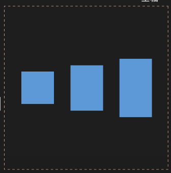

# 小程序

##### 预览图片

[媒体 / 图片 / wx.previewImage (qq.com)](https://developers.weixin.qq.com/miniprogram/dev/api/media/image/wx.previewImage.html)

```js
wx.previewImage({
	urls:			// 预览图片的链接列表
    current：		// 当前预览的图片链接
})
```

##### 渲染html

添加插件：wxparse。[uni-app中使用微信官方富文本插件wxParser_uniapp wxparse-CSDN博客](https://blog.csdn.net/weixin_43081250/article/details/108528279)

```js
<wxparser :rich-text="html"/>

data:{
	html:'<h1>this is test </h1>'
}
```

添加插件：

在 ==manifest.json== 中添加

```
"plugins": {
    "wxparserPlugin": {
        "version": "0.3.0",	
        "provider": "wx9d4d4ffa781ff3ac"
    }
},
```


在 ==pages.json== 中在对应要使用wxparser的页面的pages下的style下添加：

```
"usingComponents":{
    "wxparser": "plugin://wxparserPlugin/wxparser"
}
```


## 问题：

### 1、1与1对比不相等

如图，res是获取缓存的返回值，that.id是data中的数据，已经赋值，当两个值相等时会显示两个值不相等。


==原因== ：通过使用typeof 来获取值的类型，得到两个类型不相同。这是由于传递参数会变为string类型。

==解决== ：将传递过来的参数转换为数字类型。

```
typeof that.id

// 转换类型
that.id = parseInt(event.id);
```


# flex

## 父元素：

```
display: flex;		// 设置为flex父元素
```


### flex-direction：定义主轴方向

```
row				// 默认，水平
column			// 垂直   
row-reverse		// 水平反向
column-reverse	// 垂直反向
```


### justify-content：居中方式

```
flex-start		// 默认，主轴前对齐
flex-end		// 后对齐
center			// 居中
space-between	// 首尾等距
space-around	// 两边等距
space-evenly	// 容器等距
```


### align-items：交叉轴对齐方式

```
flex-start		// 默认，交叉轴轴前对齐
flex-end		// 后对齐
center			// 居中
baseline		// 文字基线
stretch			// 拉伸
```



### flex-wrap：超出部分样式

```
wrap			// 换行
nowrap			// 不换行
wrap-reverse	// 行序反向
```


### align-content：多行项目在交叉轴的对齐方式

```
flex-start		
flex-end
center
stretch
space-between
space-around
```


## 子元素：

### flex：三个属性的集合

```
flex-grow 		// 按照剩余空间扩充比例
flex-shrink  	// 按挤压空间比例缩小元素
flex-basis		// 元素初始大小，默认auto，根据主轴长度分配
```


# position

定位属性，默认是 ==static== 。

### relative：相对位置

为非静态元素。以原点为基准（一般是左上角），使用 top、left、right、buttom等来设置位置

### absolute：绝对位置

相当于父元素的位置，一般父元素使用 relative。跟随父元素移动

### fixed：固定位置

在窗口中固定位置，若视图移动时，这个元素也不移动。可以用于头部导航栏。

### sticky：粘性位置

若视图移动到这个元素的位置，如设置 top：0px，则在这个元素出现时，如果元素到达顶部，则固定在顶部。

# 伪类

在类后添加：再添加伪类的名称，设置伪类样式

### :visited

如超链接点击后，已经点击后的样式

### :hover

鼠标悬停在元素上显示的样式

### :active

元素处于活动状态，即点击该元素后显示的样式

### :nth-child( n )

对于 ==li== 来说，n代表第几个 li ，从1开始，代表第 n 个 li 所显示的样式； ==even== 表示所有偶数， ==odd== 表示所有奇数。或者使用 ==3n+1== 格式，这样表示第 3n+1 的 li 。


# 阴影-shadow

## 1、text-shadow

字体阴影；有4个参数，如下。

```
// x轴，y轴，模糊度（越大越模糊），阴影颜色
text-shadow: 5px 5px 5px gray;
```


```
// 仅模糊度有值
text-shadow: 0px 0px 5px yellow;
```


可以使用多个阴影，可以叠加实现效果

```
// 两个阴影实现叠加效果
text-shadow: 0px 0px 5px yellow, 0px -5px 5px red;
```


## 2、box-shadow

框阴影；有4个参数，如下。

```
// x轴，y轴，模糊度（越大越模糊），阴影颜色
box-shadow: 5px 5px 5px black;
```


# transform

变化；属性有很多，如果是translateX或Y的画，就是向X轴或Y轴移动多少像素。

### 直线移动

X正轴为右，Y正轴为下，负值相反。

```
// 向X正轴移动 50px
transform: translateX(50px);
```

### 角度

有X、Y、Z轴。

```
// X轴旋转180度
transform: rotateX(180deg);
```

### 缩放

有X、Y轴

```
// X轴上缩放 2倍
transform: scale(2);
```

### 倾斜

有X、Y轴

```
// X轴倾斜45度
transform: skewX(45deg);
```

### 矩阵

是以上操作的集合，共6个值。按以下顺序。

```
transform: matrix(
	scaleX(),
	skewY(),
	skewX(),
	scaleY(),
	translateX(),
	translateY()
)
```


# 动画

### 关键帧

可以使用关键帧来实现动画。

```css
// 自定义关键帧，mySlide为自定义名称。from里的为初始状态，to是最终状态；以从右到左为例。
@keyframes mySlide{
	from{margin-left:100%;}
	to{margin-left:0%;}
    // 或者使用百分号形式，该方式表示占用前多少时间
    50%{color:red}
    100%{color:yellow}
}
```

### 添加动画

animation可以是动画的集合，也可以单指关键帧名称。

```
animation:
	animation-duration,
	animation-timing-function,
	animation-delay,
	animation-iteration-count,
	animation-play-state,
	animation
```

```css
// 动画总时间,总共运动时间5s
animation-duration: 5s;
// 动画变化方式，linear:线性
animation-timing-function: linear;
// 动画延时
animation-delay: 0s;
// 动画重复次数，infinite:无限循环
animation-iteration-count: infinite;
// 动画状态，running: 在运行
animation-play-state: running;
// 关键帧名称
animation: mySlide;
```

