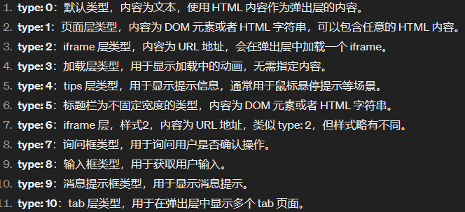
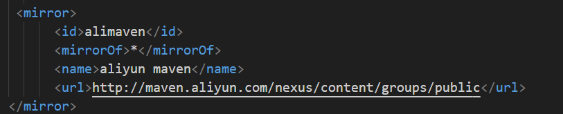
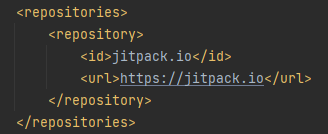

# Springboot

#### 1、日期问题

在实体类的类型为Date时，从前端传来后端的数据类型为String，需要转换为Date。可以在实体类中使用注释来告诉Springboot要将此属性格式化为日期类型

```
@DateTimeFormat(pattern = "yyyy-MM-dd HH:mm:ss")
```

#### 2、layui模板

###### layer.open

type类型共有：



# 问题：

## mysql：

### 1、删库错误：1010 - Error dropping database (can't rmdir ' auto@002dguide', errno: 41)

删除数据库时出错。直接进入数据库的Data目录，删除对应名称的数据库。❗❗❗❗❗该过程不可逆，注意使用❗❗❗❗❗


## maven

#### 1、pom.xml中Respositores配置不起作用

<font title="red">问题描述</font> ：在maven项目中的pom.xml配置其他远程仓库Respositores不起作用，默认从alibaba镜像仓库中下载

<font title="blue">解决</font> ：找到maven配置文件 ==con->setting.xml== ，修改 ==mirror== 。如图2，为原本的配置，mirrorOf指的是配置所有的远程仓库都指向下面的url。可以使用匹配的方式来取消其他远程仓库。如图3，本次项目需要使用 ==jitpack.io== 的远程仓库，即在mirrorOf后添加 ==,!jitpack.io== 。表示id为jitpack.io的远程仓库除外。

```
// 即如下，其他id的远程仓库默认跳转到maven中，除了id为jitpack.io的远程仓库
<mirror>
    <id>alimaven</id>
    <mirrorOf>*,!jitpack.io</mirrorOf>
    <name>aliyun maven</name>
    <url>http://maven.aliyun.com/nexus/content/groups/public</url>
</mirror>
```




