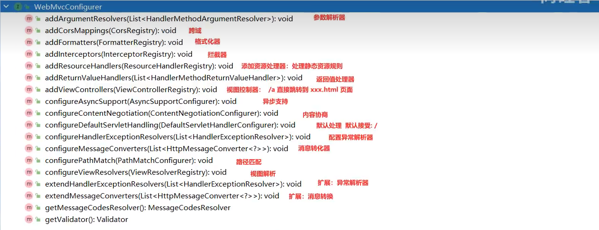
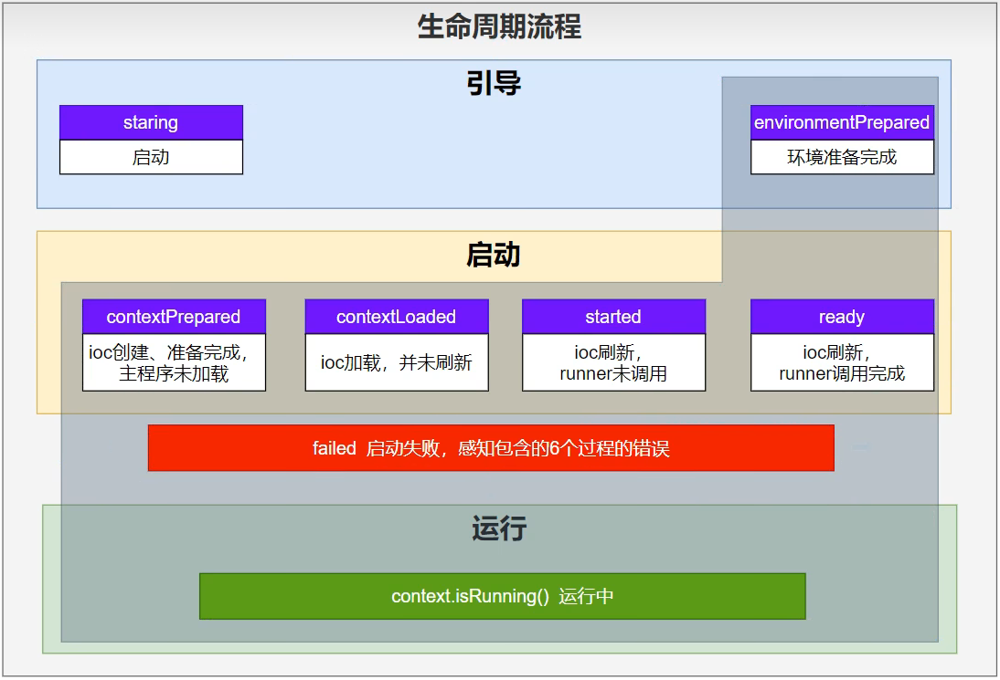
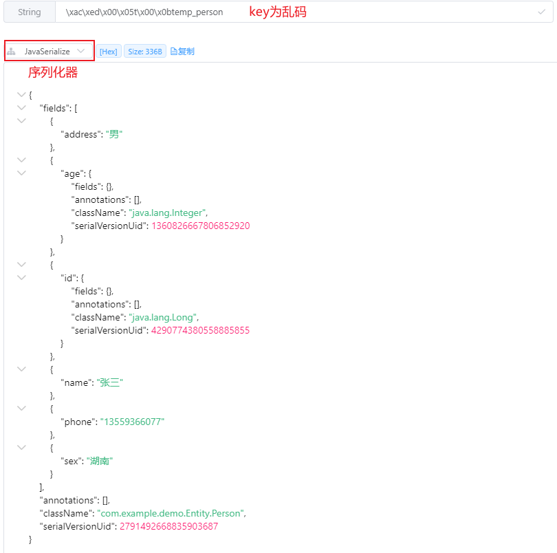
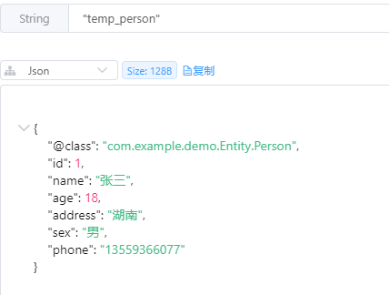
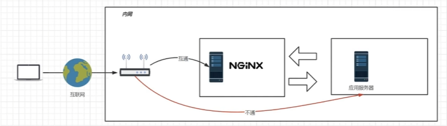

# Springboot

IOC是什么？反转控制的开发`思想`，反转：☞创建(对象)的权力；控制：交由外部环境（spring）控制。


### 1、JAVA基础

#### 1.  日期问题

在实体类的类型为Date时，从前端传来后端的数据类型为String，需要转换为Date。可以在实体类中使用注释来告诉Springboot要将此属性格式化为日期类型

```
@DateTimeFormat(pattern = "yyyy-MM-dd HH:mm:ss")
```


#### 2.  正则表达式

可以使用正则表达式来匹配有固定字符的字符串来得到不定字符

```java
// 输入字符串：/resource/薄荷巧克力/2024-06-09/8.mp4
String patternStr = "/resource/(.*?)/(.*?)/";
// 编译正则表达式
Pattern pattern = Pattern.compile(patternStr);
// 创建匹配器
Matcher matcher = pattern.matcher(url);

// 查找匹配项并提取所需部分，最终结果：把薄荷巧克力和2024-06-09得到
if (matcher.find()) {
    String extractedStr = matcher.group(1) ;
    String dataStr= matcher.group(2);
} else {
    System.out.println("No match found.");
}
```


#### 3.  队列

| 队列类型              | 线程安全 | 阻塞操作 | 主要特点                       |
| --------------------- | -------- | -------- | ------------------------------ |
| BlockingQueue         | 是       | 是       | 适用于生产者-消费者模型        |
| ArrayDeque            | 否       | 否       | 高效的双端队列                 |
| LinkedList            | 否       | 否       | 双向链表实现，支持双端操作     |
| ConcurrentLinkedQueue | 是       | 否       | 高效无锁的并发队列             |
| PriorityQueue         | 否       | 否       | 基于优先级堆，元素按优先级排序 |
| DelayQueue            | 是       | 是       | 支持元素延迟获取               |
| SynchronousQueue      | 是       | 是       | 无缓冲，适用于直接传递的场景   |

以BlockingQueue为例：

```java
// 其中，Linked是有界的；
BlockingQueue<T> taskQueue = new LinkedBlockingQueue<>();

// 使用就是简单的put、take。即放入和取出
taskQueue.put(T);
T temp = taskQueue.take();
```


#### 4.  线程

##### 1.  创建线程

###### 1)  Thread类

重写run即可：

```java
public class MyThread extends Thread {
    @Override
    public void run() {
        // 线程执行的代码
        System.out.println("Thread is running");
    }
}

public class Main {
    public static void main(String[] args) {
        MyThread myThread = new MyThread();
        myThread.start(); // 启动线程
    }
}
```

可以显示的创建线程（==不推荐==)：

```java
Thread thread = new Thread(new Runnable() {
            @Override
            public void run() {
                
            }
        });
thread.start();
```


###### 2)  Runnable类

重写run，并将创建的示例传递给Thread：

```java
public class MyRunnable implements Runnable {
    @Override
    public void run() {
        // 线程执行的代码
        System.out.println("Thread is running");
    }
}

public class Main {
    public static void main(String[] args) {
        MyRunnable myRunnable = new MyRunnable();
        Thread thread = new Thread(myRunnable);
        thread.start(); // 启动线程
    }
}
```


###### 3)  Callable

类似于Runable，但可以返回结果，并抛出异常：

ExecutorService，相对于线程管理api。

Future，相对于这个线程的实例管理，可以通过这个实例获取线程的执行等其他状态。

```java
public class MyCallable implements Callable<String> {
    @Override
    public String call() throws Exception {
        // 线程执行的代码
        return "Callable result";
    }
}

public class Main {
    public static void main(String[] args) throws ExecutionException, InterruptedException {
        ExecutorService executor = Executors.newSingleThreadExecutor();
        MyCallable myCallable = new MyCallable();
        Future<String> future = executor.submit(myCallable);
        
        String result = future.get(); // 获取结果
        System.out.println(result);
        
        executor.shutdown(); // 关闭执行器
    }
}
```


##### 2.  管理线程

###### 1)  Thread用法

```java
start()：			启动线程，调用线程的 run 方法。
run()：				线程运行的代码。
join()：				等待线程终止。
sleep(long millis)：	使当前线程休眠指定的毫秒数。
interrupt()：		中断线程。
```


###### 2)  ExecutorService

类别：

```java
Executors.newFixedThreadPool(10);		固定线程池
Executors.newSingleThreadExecutor();	单线程池
Executors.newCachedThreadPool();		缓存线程池
Executors.newScheduledThreadPool(5);	调度线程池
```

使用：创建5个大小的调度线程池，

```java
// 创建5跟大小的线程池
ScheduledExecutorService service = Executors.newScheduledThreadPool(5);

// 提交Runnable任务
service.execute(Runnable);
// 提交Callable任务，并获得Future实例
Future<String> future = service.submit(Callable);

// 关闭线程池
fixedThreadPool.shutdown();


```


###### 3)   Future

管理通过ExecutorService创建Callable线程：

```java
// 阻塞直到任务完成
future.get();

// 取消任务；true表示立即中断正在执行的任务
future.cancel(true); 

// 检查是否完成
future.isDone();

// 检查是否被取消
future.isCancelled();
```


##### 3.  线程同步和安全

###### 1)  synchronized

在代码块或方法中使用关键字，确保同一时刻只有一个线程访问该代码：

```java
private int count = 0;

public synchronized void increment() {
	count++;
}
```


###### 2)  ReentrantLock

可重入互斥锁：

```java
private int count = 0;
private ReentrantLock lock = new ReentrantLock();

public void increment() {
    lock.lock();
    	try {
    	count++;
    } finally {
    	lock.unlock();
    }
}
```


---


### 2、前端

#### layui框架

##### layer.open

type类型共有：


---


### 3、JSON

springboot默认带有jackson工具。使用starter引入时，无需再添加依赖。

#### 1.  jackson工具类

在服务端，如果使用JSON格式接收数据的话，可以使用JsonNode类型表示JSON类型。需引入依赖

```
<dependency>
    <groupId>com.fasterxml.jackson.datatype</groupId>
    <artifactId>jackson-datatype-jsr310</artifactId>
    <version>2.15.4</version>
</dependency>
```


##### 1)  ObjectMapper

###### 配置

使用bean全局配置：将null值的字段进行过滤，不返回。作为后端接口的返回值。

```
	@Bean
    public ObjectMapper objectMapper() {
        ObjectMapper mapper = new ObjectMapper();
        mapper.setSerializationInclusion(JsonInclude.Include.NON_NULL);
        return mapper;
    }
```

使用类局部配置：

```
// 忽略未知属性，即类中没有的属性不抛出异常
ObjectMapper objectMapper = new ObjectMapper();
objectMapper.configure(DeserializationFeature.FAIL_ON_UNKNOWN_PROPERTIES, false);
```


###### 使用

java对象和Json数据相互转换的类。

- 序列化：将对象类转换为JSON

```
@Data
class user{
    private String userName;
    private String userPwd;
}

{
	ObjectMapper mapper = new ObjectMapper();
	String str = mapper.writeValueAsString(user);
}

```

- 反序列化：将JSON变为对象。或者以节点的形式

```
String json = "{\"userName\":\"John\",\"userPwd\":30}";
ObjectMapper mapper = new ObjectMapper();
mapper.readValue(json, user.class);

// 节点
JsonNode node = objectMapper.readTree(json);
```


##### 2)  JsonNode

###### 常见用法：

- `get(String fieldName)`: 获取指定字段名的子节点。
- `asText()`: 将节点的值转换为字符串。
- `asInt()`: 将节点的值转换为整数。
- `asBoolean()`: 将节点的值转换为布尔值。
- `isArray()`: 检查节点是否为数组。
- `isObject()`: 检查节点是否为对象。
- `elements()`: 返回一个迭代器，用于遍历数组节点中的所有元素。


#### 2.  org.json工具类

引入

```xml
<dependency>
    <groupId>org.json</groupId>
    <artifactId>json</artifactId>
    <version>20220320</version> <!-- 或者你想要使用的最新版本 -->
</dependency>
```

##### 1)  字符串转JSON

可以直接使用JsonObject的构造方法将String类型转换为json。如下列代码。

```java
String str = "{
	"id": 1,
	"name": "Jon"
}"
JSONObject json = new JsonObject(str);
```

要取出json中的节点，可以先进行判断是否有该节点再进行获取

建议使用opt，opt方法不会抛出异常。

```java
if( !json.isNULL("id") ){	// 或json.has("id")
	int id = json.getInt("id");		// 使用json.optInt("id")
}
```


##### 2)  添加节点

使用put添加json节点

```java
JSONObject json = new JsonObeject();
json.put("")
```


---


### 4、发起HTTP请求

Spring Boot 官网：The Spring Framework provides the following choices for making calls to REST endpoints:

- [RestClient](https://docs.spring.io/spring-framework/reference/integration/rest-clients.html#rest-restclient) - synchronous client with a fluent API.（同步流式api）
- [WebClient](https://docs.spring.io/spring-framework/reference/integration/rest-clients.html#rest-webclient) - non-blocking, reactive client with fluent API.（非阻塞的流式api）
- [RestTemplate](https://docs.spring.io/spring-framework/reference/integration/rest-clients.html#rest-resttemplate) - synchronous client with template method API.（同步模板方法api）
- [HTTP Interface](https://docs.spring.io/spring-framework/reference/integration/rest-clients.html#rest-http-interface) - annotated interface with generated, dynamic proxy implementation.（动态代理接口）

#### 阻塞

##### 1、RestClient

```java
// 创建一个默认client
RestClient defaultClient = RestClient.create();

// 自定义client
RestClient customClient = RestClient.builder()
  .requestFactory(new HttpComponentsClientHttpRequestFactory())
  .messageConverters(converters -> converters.add(new MyCustomMessageConverter()))
  .baseUrl("https://example.com")
  .defaultUriVariables(Map.of("variable", "foo"))
  .defaultHeader("My-Header", "Foo")
  .requestInterceptor(myCustomInterceptor)
  .requestInitializer(myCustomInitializer)
  .build();
```

TODO:


#### 非阻塞（reactive）

##### 1、webClient

springboot官网介绍：[Configuration](https://docs.spring.io/spring-framework/reference/web/webflux-webclient/client-builder.html)；

在springboot5后，可以使用WebClient作为客户端来进行http请求。webClient是响应式编程中的。

###### 1.  依赖：

```xml
<dependency>
    <groupId>org.springframework.boot</groupId>
    <artifactId>spring-boot-starter-webflux</artifactId>
</dependency>
// 或者下面这个依赖就包含上面这个包
<dependency>
    <groupId>org.springframework.boot</groupId>
    <artifactId>spring-boot-starter-web</artifactId>
</dependency>
```


###### 2.  使用

```java
/**
 * 示例：发起一个api查询请求
 */
@Service
@Slf4j
public class ClientService {
    private final WebClient webClient;
    public ClientService(WebClient.Builder webClientBuilder, @Value("${ApiKey}") String apiKey) {
        log.info("ApiKey: {}", apiKey);
        // 使用 WebClient.build()也可以。但是webClientBuilder是springboot自动注入的。
        // codecs设置最大内存大小
        this.webClient = webClientBuilder
                .baseUrl("https://ali-weather.showapi.com")
                .defaultHeader("Accept", "application/json")
                .defaultHeader("Authorization", "APPCODE " + apiKey)
				.codecs(configurer -> configurer.defaultCodecs().maxInMemorySize(2 * 1024 * 1024))
                .build();
    }
    public Mono<Map<String, Object>> someRestCall(String name) {
        return this.webClient.get()
                .uri("/spot-to-weather?area={city}", name)
                .retrieve()
                .bodyToMono(new ParameterizedTypeReference<Map<String, Object>>() {})
                ;
    }
}

```

默认大小为`256KB`，可以设置为更大。

`官网`：Codecs have [limits](https://docs.spring.io/spring-framework/reference/web/webflux/reactive-spring.html#webflux-codecs-limits) for buffering data in memory to avoid application memory issues. By default those are set to 256KB. If that’s not enough you’ll get the following error:

```
org.springframework.core.io.buffer.DataBufferLimitException: Exceeded limit on max bytes to buffer
```

```java
WebClient.builder()
		.codecs(configurer -> configurer.defaultCodecs().maxInMemorySize(2 * 1024 * 1024))
```


---


### 5、定时任务

#### 1.  注解

可以使用注解进行定时

```java
// 这样指的是每天的h小时，m分，s秒执行
@Scheduled(cron = "s m h * * ?")
```


#### 2.  ScheduledExecutorService

使用ScheduledExecutorService类，下列代码可以通过一个tasks进行存储定时任务

```java
@Service
public class DynamicTaskScheduler {

    @Autowired
    private ScheduledExecutorService scheduledExecutorService;

    private final Map<String, ScheduledFuture<?>> tasks = new ConcurrentHashMap<>();

    public String scheduleTask(String taskId, Runnable task, LocalDateTime startTime) {
        String result = "";
        if (tasks.containsKey(taskId)) {
            cancelTask(taskId);
            result = "更新任务成功！";
        }else{
            result = "添加任务成功！";
        }
        long initialDelay = computeInitialDelay(startTime);
        long period = TimeUnit.DAYS.toMillis(1);

        ScheduledFuture<?> scheduledTask = scheduledExecutorService.scheduleAtFixedRate(task, initialDelay, period, TimeUnit.MILLISECONDS);
        tasks.put(taskId, scheduledTask);

        return result;
    }

    public void cancelTask(String taskId) {
        ScheduledFuture<?> scheduledTask = tasks.remove(taskId);
        if (scheduledTask != null) {
            scheduledTask.cancel(false);
        }
    }

    public String getAllTaskIds(){
        StringBuilder status = new StringBuilder("当前任务列表：\n");
        tasks.forEach((taskId, future) -> {
            status.append("任务ID: ").append(taskId).append(", 状态: ").append(future.isCancelled() ? "已取消" : "运行中").append("\n");
        });
        return status.toString();

    }

    private long computeInitialDelay(LocalDateTime startTime) {
        LocalDateTime now = LocalDateTime.now();
        if (now.isAfter(startTime)) {
            startTime = startTime.plusDays(1);
        }
        return Duration.between(now, startTime).toMillis();
    }
}
```


---


### 6、注解

#### 1.  条件注解

```java
@ConditionOnxxx			// 其中xxx为bean、class、等等
@ConditionOnMissingxxx	

eg. 如果存在User这个类则创建Temp这个bean
@ConditionOnClass(name="com.entity.User")
@Bean
public Temp Temp(){
	return new Temp()
}
```


#### 2.  属性绑定

@ConfigurationProperties或使用@EnableConfigurationProperties()

```java
// 使用@ConfigurationProperties()来表示与配置文件中的进行绑定
eg. 使用prefix将pig前缀的配置与类中的属性进行绑定

@ConfigurationProperties(prefix = "pig")
@Component
public class pig(){
	private Long id;
	private String name;
}

// 配置文件：
pig.id=1
pig.name="haha"

// @EnableConfigurationProperties()其实就是上面那个加一个bean，主要用于第三方库的配置
```


#### 3.  初始化执行

在bean初始化时执行的函数：

```java
@PostConstruct
public void initialize() {
	System.out.println("初始化！")
}
```


---


### 7、日志

日志由`框架`和`实现`两部分组成。

<font title="blue">日志框架</font>即日志门面，提供统一的日志记录接口，屏蔽底层日志实现。默认为`SLF4j`。

<font title="blue">日志实现</font>即具体记录日志的实现库，决定了日志的输出方式、格式、目标等。默认为`Logback`。

#### 1.  日志等级

```
trace
debug
info
warn
error
```


#### 2.  使用

```java
// 1. 通过日志工厂获得日志对象
Logger logger = LoggerFactory.getLogger(getClass());
logger.info("测试");

// 2. 在bean上注解@Slf4j，使用自动注入的log
@Slf4j
@RestController
public class TContorller{
	@GetMapping("/test")
	public String test(){
		log.info("测试");
		return "测试";
	}
}
```


#### 3.修改默认实现库

将默认的Logback修改为log4j2，但实际上性能差不多。

```xml
<dependency>
     <groupId>org.springframework.boot</groupId>
     <artifactId>spring-boot-starter</artifactId>
     <exclusions>
         <exclusion>
             <groupId>org.springframework.boot</groupId>
             <artifactId>spring-boot-starter-logging</artifactId>
         </exclusion>
     </exclusions>
 </dependency>
 
 <dependency>
     <groupId>org.springframework.boot</groupId>
     <artifactId>spring-boot-starter-log4j2</artifactId>
 </dependency>
```


#### 4.  配置

```properties
# 在配置文件中，使用logging开头的配置
# eg. 修改时间格式
logging.pattern.dateformat=yyyy-MM-dd HH:mm:ss.SSS

# eg. 分组级别
logging.group.xxx=包名1,包名2...
logging.level.xxx=debug

# eg. 输出日志文件，默认路径为根目录。name比path优先度高，使用name即可
logging.file.name=xxx
logging.file.path=xxx

# eg. 归档、切割。切割名为日期加第几份，每份最大为10MB,最长保存7天
loggin.logback.rollingpolicy.file-name-pattern=${LOG_FILE}.$d{yyyy-MM-dd}.%i.gz
loggin.logback.rollingpolicy.max-file-size=10MB
loggin.logback.rollingpolicy.max-history=7
```


#### 5.  框架配置

可以在resource下存放框架配置文件，名字符合规范就会默认加载该配置文件，而不是使用默认配置。可以自行查找输出格式。

```java
// logback的框架配置文件
logback-spring.xml
```


### 8、maven

启用spring-boot-starter后，会导入许多默认框架，可以移除默认框架再引入新框架。

```xml
eg. 以移除默认日志框架logback，引入log4j2为例
 <dependency>
     <groupId>org.springframework.boot</groupId>
     <artifactId>spring-boot-starter</artifactId>
     <exclusions>
         <exclusion>
             <groupId>org.springframework.boot</groupId>
             <artifactId>spring-boot-starter-logging</artifactId>
         </exclusion>
     </exclusions>
 </dependency>
 
 <dependency>
     <groupId>org.springframework.boot</groupId>
     <artifactId>spring-boot-starter-log4j2</artifactId>
 </dependency>
```


---


### 9、MVC配置

创建一个Confiuration注解的配置来实现WebMvcConfigurer接口

```java
@Configuration
public class WebMvcConfig implements WebMvcConfigurer {
	
}
```



---


### 10、内容协商

底层的实现是由`WebMvcConfigurationSupport`

#### 1.  返回内容

##### 1)  xml

在实体类中添加注解：

```java
@JacksonXmlRootElement
@Data
public class Person{
    String name;
    Integer age;
}
```

添加依赖

```xml
 <dependency>
     <groupId>com.fasterxml.jackson.dataformat</groupId>
     <artifactId>jackson-dataformat-xml</artifactId>
 </dependency>
```


##### 2)  其他协议

如yaml

添加依赖

```xml
 <dependency>
     <groupId>com.fasterxml.jackson.dataformat</groupId>
     <artifactId>jackson-dataformat-yaml</artifactId>
 </dependency>
```

添加配置

```properties
// 增加一种类型，名字为xxx。如：ymal
spring.mvc.contentnegotiation.media-types.xxx=application/xxx
```

 xxx 实现`AbstractHttpMessageConverter<Object>` 

```java
// 其中，supports是所支持的类型，可以使用判断，如果支持就return true；基本上除了基本类型都可以支持
// readInterna 是后端接收时的转换
// writeInternal 是发送时的转换w
```

在MVC配置中添加拓展Message：

```java
public void configureMessageConverters(List<HttpMessageConverter<?>> converter){
	converter.add(xxx)
}
```


#### 2.  协商方式

两种协商方式：

##### 1)  http协商

第一种是可以使用http的accept属性设置，如accept:applacation/json，返回json。

##### 2)  参数协商

默认关闭，需要开启配置。在url中带上format参数，如：/person?format=xml。

```properties
spring.mvc.contentnegotiation.favor-parameter=true
```


---


### 11、错误处理

在遇到错误时，默认是SpringMVC来进行错误处理。默认是没有。再交给springBoot进行处理。默认是白页。

如果发生了错误码的错误，会自动去template下的/error/错误码.html下渲染。

如果没有错误码.html，则去找5xx.html/4xx.html。

再没有，就到error错误视图，这是默认的。


#### 1.  类中的错误处理

使用`@ExceptionHandler(xxx错误类型)`。

```java
//使用@ExceptionHandler(Exception.class)
@ResponseBody
@ExceptionHandler(Exception.class)
public String handeException(Exception e){
	return "遇到错误："+e.getMessage();
}
```


#### 2.  全局错误处理

使用`@ControllerAdvice`，注解在类上

```java
@ControllerAdvice
public class GlobalExceptionHandler{
    @ResponseBody
	@ExceptionHandler(Exception.class)
    public String handeException(Exception e){
		return "统一处理，遇到错误："+e.getMessage();
	}
}
```


#### 3.  使用ProblemDetails进行处理

ProblemDetails是使用 `RFC 7807` 规范的错误处理规范，新增的media类型：`application/problem+json` 。可以是springboot的默认错误处理。

使用：

```properties
spring.mvc.problemdetails.enabled=true
```


---


### 12、全局获取request和response

```java
ServletRequestAttributes attributes = (ServletRequestAttributes) RequestContextHolder.getRequestAttributes();

HttpServletResponse response = attributes.getResponse();
httpServletRequest request = attributes.getRequest();
```


---


### 13、函数式web

与以往的方式不同，函数式web用一个bean设置所有路由，再通过路由绑定处理函数。

```java
@Component
public class Test{
    @bean
    public RouterFunction<ServerResponse> userRoute(UserBizHandler handler){
        return RouterFunctions.route()
            .GET("/user/{id}", RequestPredicates.accept(MediaType.ALL),handler::get)
            .POST("/user",RequestPredicates.accept(MediaType.APPLICATION_JSON),handler::update)
            .build();
    }
}


// UserBizHandler类，用Service或Component注解都可以
public ServerResponse get(ServerRequest request){
    User user = new User(1, "hh")
    return ServerResponse.ok()
        .body(user);
}
...
```


---


### 14、环境隔离

对于不同的环境（开发、测试和生产），有着不同的配置或者组件，可以自动根据不同的环境加载不同的配置和组件。

#### 1.  组件

##### 1)  标识环境

使用`@Profile` 注解来标识环境，默认是default环境

```java
@Profile({"dev", "test"})
@Component
public class test{
    
}
```

##### 2)  激活环境

1. 配置文件设置环境

   ```java
   spring.profiles.active=dev,test
   ```

2. 使用命令行

   ```shell
   java -jar test.jar --spring.profies.active=dev
   ```

包含环境，不管激活环境是否有这个，都生效

```properties
spring.profiles.include[0]=dev
```


#### 2.  配置文件

创建一个按照规范命名的配置文件：`application-{profile名}.properties/yaml`。

激活环境与组件的激活方式相同。

如果主配置文件与隔离环境的配置文件冲突，以隔离环境为准。


---


### 15、外部配置

springboot支持外部配置，即打包好的项目，根据项目外的配置进行启用。

以下是SpringBoot属性源加载顺序。<font title="blue">后面的会覆盖前面的值</font>。由低到高，高优先级配置覆盖低优先级

常用优先级：命令行 > 配置文件 > 代码配置

打包后：包外 > 包内；<font title="red">直接在jar包同目录下放置properties文件即可</font>

多配置：profile > application

1. `默认属性`（通过SpringApplication.setDefaultProperties指定的）
2. @PropertySource指定加载的配置（需要写在@Configuration类上才可生效）
3. `配置文件`（application.properties/yml等）
4. RandomValuePropertySource支持的random.*配置(如：@Value("$(random.int)"))
5. `OS环境变量`
6. Java系统属性（System.getPropertieso()）
7. JNDI属性（来自java:comp/env）
8. ServletContext初始化参数
9. ServletConfig初始化参数
10. SPRING_APPLICATION_JSON属性（内置在环境变量或系统属性中的JSON）
11. `命令行参数`
12. 测试属性。（@SpringBootTest进行测试时指定的属性）
13. 测试类@TestPropertySource注解
14. `Devtools`设置的全局属性。（$HOME/.config/spring-boot）


---


### 16、测试

更多测试方法详见官网：[JUnit 5 ](https://junit.org/junit5/docs/current/user-guide/#overview) 

```java
// 测试名字
@DisplayName("测试1")

// 所有测试方法测试之前 
@BeforeAll		// 只一次
@BeforeEach		// 每个测试类一次
```


#### 1.  断言测试

使用`Assertions`类来进行断言，即测试结果是否与目标结果一致。等等等。

```java
@Test
void test1(){
	int sum = service.sum(1, 2);
	Assertions.assertEquals(3, sum);
}
```


#### 2.  嵌套测试

使用`@Nested`来注解在内部类上。

```java
@SpringBootTest
public class test{
    @Nested
    class inTest{
        static List<String> list;
        
        @BeforeEach
        void push(){
        	list.add("hello");    
        }
        
        @Test
        void testRemove(){
            list.remove(0)
        }
    }
}
```


#### 3.  参数化测试

使用`@ParameterizedTest`。

`@ValueSource()`结合。会随机的从设置的参数列表中取出一个。

```java
@ParameterizedTest
@ValueSource(strings={"one","two","three"})
@DisplayName("参数化测试")
public void paramTest(String str){
    log.info(str);
}
```

`@MethodSource("method")`结合。这个方法的返回值就是测试的参数。

```java
@ParameterizedTest
@MethodSource("method")
@DisplayName("参数化测试")
public void methodTest(String str){
    log.info(str);
}

static Stream<String> method(){
    return Stream.of("one", "tow", "three")
}
```


---


### 17、监听生命周期

实践场景：在项目启动之前，通过令牌判断该项目是否过期，过期需续费。则需要在启动前就进行判断。


#### 1.  实现接口

实现`SpringApplicationRunListener`接口

```java
package com.example.listener;
public class MyAppListener implements SpringApplicationRunListener{
 	// 重写接口方法，接口方法就是各个生命周期。
 	...
}
```


#### 2.  添加配置

在类路径下创建`META-INF`目录，在其下放一个文件：`spring.factories`。

```java
--resource
	--META-INF
		--spring.factories
	--static
		...
		
// spring.factories，填写 [实现接口类的全类名]
org.springframework.boot.SpringApplicationRunListener=com.example.listener.MyAppListener
```




---


### 18、事件驱动

事件驱动开发，也就是异步事件。可以通过监听器来监听事件，当一个事件发生时，发布广播。监听该事件的监听器就执行相应操作。

SpringBoot有自带9大事件。

<font title="blue">优点</font>：以设计模式：对`新增开发，对修改关闭`来实现。对于新增的业务，不进行修改原来的代码，而是再新增代码，以避免修改出错。

实践例子：当一个用户登录时进行累积积分、记录登录信息和发放优惠卷等操作。


#### 1.  创建事件

##### 1)   创建事件类

创建一个事件类，并继承SpringBoot底层实现的`ApplicationEvent`。

```java
public class LoginEvent extends ApplicationEvent {
    // Object 可以修改为任意对象，用于传递事件信息。如：User，用来传递登录的用户信息。
    public LoginEvent(Object source) {
        super(source);
    }
}
```

##### 2)  创建事件发布类

通过实现`ApplicationEventPublisherAware`，来注入`ApplicationEventPublisher`。再通过该对象调用底层api来发布事件。

```java
public class EventPublish implements ApplicationEventPublisherAware {
    ApplicationEventPublisher applicationEventPublisher;
    /**
     * 接收事件，并调用底层api发布事件。
     * @param event
     */
    public void sendEvent(ApplicationEvent event){
        applicationEventPublisher.publishEvent(event);
    }
    /**
     * 在SpringBoot启动时，会自动调用该方法，将ApplicationEventPublisher注入进来。
     * 此后直接调用该注入对象的底层方法即可发布事件。
     * @param applicationEventPublisher
     */
    @Override
    public void setApplicationEventPublisher(ApplicationEventPublisher applicationEventPublisher) {
        this.applicationEventPublisher = applicationEventPublisher;
    }
}
```


#### 2.  监听事件

可以使用`event.getSource()`来获取发布事件时传递的参数。

##### 1)  注解实现(推荐)

使用注解`@EventListener`注解在方法上，方法的参数为需要接收的事件。

```java
@EventListener
public void eventListen(LoginEvent event){
    log.info("== 使用注解接收事件 == {} ==",event);
}
```


##### 2)   实现类(不推荐)

实现`ApplicationListener<ApplicationEvent>`，其中`ApplicationEvent`为需要监听的事件，可以是所有事件，也可以是特定事件。

重写`onApplicationEvent`即可。当事件发生时，会自动调用该方法。

```java
public class EventImplement implements ApplicationListener<LoginEvent> {
    @Override
    public void onApplicationEvent(LoginEvent event) {
        service(event);
    }
    /**
     * 业务实现
     * @param event
     */
    public void service(LoginEvent event) {
        log.info("== 接收到事件 == {} ==",event);
    }
}
```


#### 3 .  发布事件

在需要发布事件的地方注入事件发布类。直接调用事件发布方法。

```java
@Autowired
EventPublish publish;

@GetMapping("/event")
public void event(@RequestParam("msg") String msg){
    log.info("=== msg = {} ===",msg);
    LoginEvent event = new LoginEvent(msg);
    publish.sendEvent(event);
}
```


---


### 19、自定义starter

若有需要将通用工具给其他项目使用，可以通过自定义starter给其他项目引用。

#### 1.  业务工具

以绑定配置数据为例：

Test类：对配置文件的数据进行绑定，以`test.start`前缀。

```java
@NoArgsConstructor
@AllArgsConstructor
@Data
@ConfigurationProperties(prefix = "test.start")
@Component
public class Test {
    private String name;
    private Integer age;
    private String sex;
}
```

TestController类：

```java
@RestController
@RequestMapping("/test")
public class TestController {
    @Autowired
    private Test test;
    @GetMapping("/starter")
    public String starter()
    {
        return "this is test starter.\n" +
               "properties is " +
               "name = {{ " +test.getName() +
               " }} , age = {{ "+test.getAge()+
               "}} , sex = {{ " +test.getSex() +
               " }}";
    }
}
```

（可选）写一个自动配置类，对这些容器进行导入。

TestAutoConfiguration类：引入TestController和Test的容器

```java
@Import({TestController.class, Test.class})
@Configuration
public class TestStarterAutoConfiguration {}
```


#### 2.  抽取

两种方法，推荐自动注入，无需再进行操作。


##### 1)   自动注入(推荐)

依赖于springboot的SPI机制：springboot会自动扫描类路径下的`META-INF/spring`的xxx.imports文件中的类引用。从而注册容器。

```java
--|resource
    --|META-INF
    	--|spring
    		-org.springframework.boot.autoconfigure.AutoConfiguration.importes
```

```properties
# 类路径引用，可以导入第一步的autoconfigure或者每个容器都导入。
com.example.demostart.TestStarterAutoConfiguration
```


##### 2)   使用Enable机制(不推荐)

使用springboot的Enable机制，在主程序入口使用注解@EnabelXxxx进行导入。

创建一个注解，通过导入`TestStarterAutoConfiguration`，使得注解`EnableTest`就导入其他容器。

```java
@Target({ElementType.TYPE})
@Retention(RetentionPolicy.RUNTIME)
@Documented
@Import({TestStarterAutoConfiguration.class})
public @interface EnableTest{}
```


#### 3.  打包

将工具项目的`主程序`删掉，`pom.xml`中的build下的`插件`删除。再点击`打包`。

得到的jar包，可以直接存放于`本地maven`的`repository`下即可。


### 其他

#### 1、类型擦除

`源自GPT`：在Java中，泛型类型信息在运行时会被擦除，这意味着你无法在运行时获取关于泛型的具体类型的信息。这在处理JSON反序列化时可能会造成问题。例如，当你希望将一个JSON响应反序列化为一个泛型类型（例如Map<String, Object>）时，类型擦除会导致Spring无法正确地进行反序列化。

简单的说就是当远程调用返回的数据是json格式时，但是响应的值不是json格式。就可以使用类型擦除来将json反序列化为特定格式

<font title="blue">引用</font>：[Http Interface](#2、Http Interface)

```java
// 反序列化json
new ParameterizedTypeReference<Map<String, Object>>(){}
```


#### 2、秒表

由`springframework`中的工具类提供。

```java
// 定时查看某些操作的耗时时间
StopWatch stopwatch = new StopWatch();
stopwatch.start();
...
stopwatch.stop();
log.info("定时时间：%d ",stopwatch.getTotalTimeMillis());
```


### 问题

#### 1、注入顺序

<font title="red">现象</font>：在一个bean中使用`@Value`注入配置属性时，会遇到配置属性的值为null。

<font title="yellow">问题所在</font>：注入时机顺序的问题：Spring在创建bean时会自动的执行构造函数，但是`@Value`的注入是在所有的`Bean`的创建完毕后才进行注入。`具体详情需要查看源码`

<font title="blue">解决</font>：若需要在组件的构造函数中使用到配置文件的属性，可以在构造函数中传入属性值，即需要先注入配置属性再执行构造函数。

如：

```java
public class ClientService {
//    @Value("${ApiKey}")
//    private String apiKey;
    private final WebClient webClient;
    public ClientService(WebClient.Builder webClientBuilder, @Value("${ApiKey}") String apiKey) {
        log.info("ApiKey: {}", apiKey);
        this.webClient = webClientBuilder
                .baseUrl("https://ali-weather.showapi.com")
                .defaultHeader("Authorization", "APPCODE " + apiKey)
                .build();
    }
}
```


### 底部

# 框架

## 1、mybatis-plus框架

### 1.  Db工具类

提供了一种快捷的方式来进行数据库操作，简化了代码并提高了开发效率。通过 `Db.lambdaQuery` 方法，可以直接进行查询并选择特定字段。这种方式特别适合快速开发和测试场景。如：

查询符合条件的列表

```java
Db.lambdaQuery(User.class)
    .eq(User::getId, id)
    .select(User::getId,
    User::getUserPwd,
    User::getUserName
    )
    .list();
```

分页查询

```java
Page<User> pageRequest = new Page<>(page, size);
return Db.lambdaQuery(User.class)
    .eq(User::getId, id)
    .select(User::getUserAccount,
        User::getUserPwd,
        User::getUserName
    )
    .page(pageRequest);
```


### 2.  排除映射

使用`@TableField(exist = false)`来排除映射到数据库表。

如果要在后端向前端返回某两个实体类有相互重合的json数据，可以在其中一个实体类添加一个map<String, Object>字段，并使用注解@TableField(exist = false) （mybatis-plus）来进行排除ORM映射。

```java
public class User{
	@TableId(type = IdType.AUTO)
	private Integer id;
	
	private String name;
	
	@TableField(exist = false)
	private Map<String, Object> core;
}
```


---


## 2、Thymeleaf模板引擎

官网：[Thymeleaf](https://www.thymeleaf.org/doc/tutorials/3.1/usingthymeleaf.html#appendix-b-expression-utility-objects) 

### 1.  基本使用

```
${}		// 用来获取变量
@{}		// 用来使用url路径
...
```

可以使用工具类，可以参照官网。使用#来使用

```html
// 转化为大写
${#string.toUpperCase(name)}

// 还有session、param、application
```


### 2.  模板布局

用于例如导航栏等公共布局。与vue中的组件相似。

创建片段，使用`th:fragment`来创建。

```html
// 创建一个判断，在可以新建一个html来保存，如xxx.html
<header th:fragment="myheader" ...>
	...
</header>
```

使用判断，使用`th:replace`来进行替换。替换名为`~{模板名::片段名}`。

```html
// 将div替换为上面的片段，如导航栏
<div th:replace="~{xxx :: myheader}" ...>
</div>
```


### 3.  国际化

在template目录下新建`messages.properties`，表示国际化的配置文件。其中配置默认配置。

中文环境为`messages_zh_CN.properties`。

英文环境为`messages_en_US.properties`。

```properties
# messages.properties 文件
login=login
sing-up=sing-up

# messages_zh_CN.properties 文件
login=登录
sing-up=注册

# messages_en_US.properties 文件
login=login
sing-up=sing-up
```

接着在html中使用`#{}`来获取对应key的value

```html
// 此时会根据用户语言进行切换
<div th:text="#{login}"></div>
```


## 3、redis

### 1.  引入依赖

```xml
<dependency>
    <groupId>org.springframework.boot</groupId>
    <artifactId>spring-boot-starter-data-redis</artifactId>
</dependency>
```


### 2.  查看autoconfig

查看到有`stringRedisTemplate`和`redisTemplate`。这个就是redis的工具类。

通过查看`RedisProperties`可以得知，配置文件是以`spring.data.redis`开头。

由签名可知，`redisTemplate`是一个类似于Map。

```java
@AutoConfiguration
@ConditionalOnClass({RedisOperations.class})
@EnableConfigurationProperties({RedisProperties.class})
@Import({LettuceConnectionConfiguration.class, JedisConnectionConfiguration.class})
public class RedisAutoConfiguration {
    public RedisAutoConfiguration() {
    }

    @Bean
    @ConditionalOnMissingBean({RedisConnectionDetails.class})
    PropertiesRedisConnectionDetails redisConnectionDetails(RedisProperties properties) {
        return new PropertiesRedisConnectionDetails(properties);
    }

    @Bean
    @ConditionalOnMissingBean(
        name = {"redisTemplate"}
    )
    @ConditionalOnSingleCandidate(RedisConnectionFactory.class)
    public RedisTemplate<Object, Object> redisTemplate(RedisConnectionFactory redisConnectionFactory) {
        RedisTemplate<Object, Object> template = new RedisTemplate();
        template.setConnectionFactory(redisConnectionFactory);
        return template;
    }

    @Bean
    @ConditionalOnMissingBean
    @ConditionalOnSingleCandidate(RedisConnectionFactory.class)
    public StringRedisTemplate stringRedisTemplate(RedisConnectionFactory redisConnectionFactory) {
        return new StringRedisTemplate(redisConnectionFactory);
    }
}
```


### 3.  使用

#### stringRedisTemplate

在注入`stringRedisTemplate`后可以直接使用。这个类都是用作字符串操作。

```java
@Autowired
private StringRedisTemplate template;
```

其中，有能直接对相应类型操作的方法。

```java
// 使用ops来表示操作某个类型的数据。其下有许多操作数据的方法。
template.opsXxx()
    
// eg.操作普通的字符串
Long test = template.opsForValue().increment("testAdd");
log.info("使testAdd键的数据加1，并获取: "+test);
```


#### RedisTemplate

在注入后直接使用，可以保存对象。但是该对象的类需要实现`Serializable`，交由此类进行序列化。不进行序列化会出错。

```java
// 注入，其用法与StringRedisTemplate相似，但这个可以保存对象。
@Autowired
private RedisTemplate<Object, Object> template;

// 测试保存对象，保存以json保存。
Person person =new Person(1L, "张三", 18, "湖南", "男", "1377");
template.opsForValue().set(temp_value,person);
Person temp = (Person) template.opsForValue().get(temp_value);
log.info("temp person = {}",temp);


/**
 * Person类，若需要保存，则需要实现Serializable
 */
@NoArgsConstructor
@AllArgsConstructor
@Data
public class Person implements Serializable {
    Long id;
    String name;
    Integer age;
    String address;
    String sex;
    String phone;
}
```


#### 定制RedisTemplate

由于RedisTemplate实现的是默认的序列化，即JDK序列化，只有使用java反序列化才能够正常查看。

故可以修改序列化为json格式。这样就是正常的json数据。

由autoconfigure源码查看可知，若有一个`redisTemplate`的bean，则不创建默认的redisTemplate。只需要将原来的代码进行修改即可。

创建一个配置类：复制源码，并添加一行设置默认序列化器。

```java
	 @Bean
    public RedisTemplate<Object, Object> redisTemplate(RedisConnectionFactory redisConnectionFactory) {
        RedisTemplate<Object, Object> template = new RedisTemplate();
        template.setConnectionFactory(redisConnectionFactory);
        // 添加此行代码，具体有哪些序列化器，可以直接跳转到该方法进去查看。
        template.setDefaultSerializer(RedisSerializer.json());
        return template;
    }
```

以下两图分别是使用默认序列化和json序列化保存的数据。




## 4、Swagger

或knife4j。这种方式是侵入式的，需要写额外注解。或者可以使用ApiFox，这种非侵入式的，是通过注释来获取信息。

### 1.  引入依赖

```xml
 <dependency>
     <groupId>org.springdoc</groupId>
     <artifactId>springdoc-openapi-starter-webmvc-ui</artifactId>
     <version>2.6.0</version>
</dependency>
```


### 2.  使用

```java
// 用在controller上，描述该controller是做什么的
@Tag(name = "", description = "")
// 描述参数
@Parameter(description = "")
// 描述方法作用
@Operation(summary = "",description = "")
// 返回的数据描述。标注在实体类或实体类的字段上。
@Schema(title = "")
```

如果项目大，可以使用分组查看。以url的前缀来分组。

```java
@Bean
public GroupedOpenApi publicApi(){
    return GroupedOpenApi.builder()
        .group("xxx")
        .pathsToMatch("/test/**")
        .build();
}

/**
  * 其他一些描述
  */
@Bean
public OpenAPI docsOpenAPI(){
    return new OpenAPI()
        .info(new Info()
             .title("xxxAPI")
              .description("测试接口")
              .version("v0.0.1")
              .license(new License().name("Apache 2.0").url("http://springdoc.org")))
        .externalDocs(new ExternalDocumentation()
                     .description("wiki document")
                     .url("https://springshop.wiki.github.org/docs"))；
}
```


## 5、SSE

全名为：`server-sent events`；chatgpt返回数据的方式就是这种。

服务器主动向客户端推送消息有两种方式（暂知），一种是`WebSocket`，一种是`SSE`。但是websocket是双向连接，也更消耗资源，可以跨域。SSE只是服务器单向客户端，`不可跨域`。若只需要服务端推送到客户端，用SSE即可。

前端使用的API为：<font title="blue">EventSource</font>；后端响应的数据类型是：<font title="blue">Content-Type: text/event-stream</font>；

### 1.  引入依赖

spring-bootx项目自带SseEmitter库，在`spring-webmvc`下。


### 2.  使用

SseEmitter的构造方法可以传入一个Long表示超时时间，默认是30分钟。设置为0L为永不超时。

#### 1)  send

有三个重载方法：会抛出`IOEception`；

```java
send(Object object);							// 对象自动转换为json
send(Object object, MediaType mediaType);		// 媒体类型
send(SseEmitter.SseEventBuilder builder);		// 自定义事件

// 使用方法
sse.send("hello");
sse.send(person, MediaType.APPLICATION_XML);
sse.send(SseEmitter.event());


/**
  * 测试，简单的隔一秒发送数据。
  */
@GetMapping("/event")
public SseEmitter event() throws IOException {
    Person person = new Person(1L, "张三", 18, "北京", "男", "123125512");
    SseEmitter emitter = new SseEmitter();
    new Thread(() -> {
        try {
            emitter.send("hello");
            sleep(1000);
            emitter.send(person, MediaType.APPLICATION_JSON);
            sleep(1000);
            emitter.send(SseEmitter.event()
                         .id("1")
                         .name("customEvent")
                         .data("Custom event data"));
        } catch (IOException | InterruptedException e) {
            throw new RuntimeException(e);
        }
    }).start();
    return emitter;
}
```


#### 2)  onXxx

分别是三个异步函数，用于检查该sse的状态。

```java
emitter.onCompletion(() -> System.out.println("onCompletion"));
emitter.onError((e) -> System.out.println("onError："+e));
emitter.onTimeout(() -> System.out.println("onTimeout"));
```


#### 3)  其他

```java
emitter.complete();			// 手动正常结束
emitter.getTimeout();		// 获取超时时间
emitter.completeWithError(new RuntimeException("测试发生异常！"));		// 手动设置错误
```


## 6、kafka

消息队列。

### 1.  依赖

```xml
<dependency>
    <groupId>org.springframework.kafka</groupId>
    <artifactId>spring-kafka</artifactId>
</dependency>
```


### 2.  使用

与redis类似，有一个`Template`，用于对kafka的收发消息。

由于send是异步的，若要查看发送1w条数据的时间，需要将使用异步处理的工具类：`CompletableFuture`。进行阻塞，等待异步处理结束。

```java
CompletableFuture[] futures = new CompletableFuture[10000];
for (int i = 0; i < 10000; i++) {
    // 发送消息
    CompletableFuture future = template.send("news","test","这是一条测试发送数据！");
    futures[i] = future;
}
CompletableFuture.allOf(futures)
    .join();
```

若需要发送json格式的数据（不论是key还是value），需要修改序列化器。默认的序列化器是String类型的序列化器。

直接跳转到kafkaProperties中，查看对应属性的值，并查看该值的实现。可以发现有json序列化器。

```properties
# 发布者value序列化
spring.kafka.producer.value-serializer=org.springframework.kafka.support.serializer.JsonSerializer
```


## 底部


# 服务器应用

## 1、frp内网穿透

### 1.  前提准备

云服务器一台，可选择云服务器、轻量型服务器、vps。

### 2.  开始

在服务器中下载对应的 ==frp== 版本。：[frp github](https://github.com/fatedier/frp)

这里以0.53.2为例

#### 1)  服务器

下载好后，直接运行下面这个shell文件即可。会在运行目录下生成一个 ${dirname} 变量的目录。

若要修改下载的 frp 版本，需修改第 4、5行的对应frp版本号。

若要修改服务器监听端口，修改40行的对应值。

```shell
#!/bin/bash

# 下载资源的URL
version="0.53.2"
name="frp_0.53.2_linux_amd64.tar.gz"
dirname=$(basename "$name" .tar.gz)
url="https://github.com/fatedier/frp/releases/download/v${version}/${name}"

echo $url

if ls *frp* 1> /dev/null 2>&1; then
    echo "文件存在"
else
    echo "文件不存在"
     # 下载资源
    wget --timeout=600 --quiet --show-progress "$url"
    # 检查wget的返回码
    if [ $? -eq 0 ]; then
        echo "下载完成"
        # 解压文件
    else
        echo "下载失败"
        exit
        # 在这里可以添加下载失败后的处理逻辑
    fi
fi

if [ -d "$dirname" ]; then
    echo "目录存在"
else
    echo "目录不存在"
    tar -zxf "$name"
fi

cd "$dirname"
rm -rf frpc frpc.toml
# bindPort 是云服务器监听的端口，需开放
# vhostHTTPPort 是对外http服务的端口，vhostHTTPSPort 同理。若不需要http或https，可去掉这两行
echo "" > frps.toml
echo -e "bindPort=7000\nvhostHTTPPort=80\nvhostHTTPSPort=443\n" > frps.toml
nohup ./frps -c frps.toml &
sleep 1
pid=$(pgrep -f "frps")
if [ -z "$pid" ]; then
    echo "frps服务未启动，请自行启动"
else
    echo "frps进程pid的值为 $pid"
    rm -f frps-pid*
    touch "frps-pid-${pid}"
fi
```

设置服务

```shell
sudo vim /etc/systemd/system/frps.service
```

```shell
[Unit]
# 服务名称，可自定义
Description = frp server
After = network.target syslog.target
Wants = network.target

[Service]
Type = simple
# 启动frps的命令，需修改为您的frps的安装路径
ExecStart = /path/to/frps -c /path/to/frps.toml

[Install]
WantedBy = multi-user.target

```

```shell
sudo systemctl start frps
sudo systemctl enable frps
```


#### 2)  内网主机

最好下载与服务器对应版本的 frp。

下载对应系统版本的 frp。

##### windows版本

解压出来后，进入frpc.exe所在目录，可以创建一个文件bat。执行下面命令

其中第8行的xxx需要修改为对应的云服务器的公网ip

第24行中的xx.domin.xx需要修改为对应域名，ip或许可以。

```shell
@echo off
set filename=frpc.toml
del frps
del frps.toml

touch e.txt
(
echo serverAddr = "xxx.xxx.xxx.xxx" 
echo serverPort = 7000

echo # ssh连接
echo [[proxies]]
echo name = "ssh"
echo type = "tcp"
echo localIP = "127.0.0.1"
echo localPort = 22
echo remotePort = 6000

echo  # http服务
echo [[proxies]]
echo name = "web"
echo type = "http"
echo localPort = 80
echo customDomains = ["xxx.domin.xxx"]
) > frpc.toml
./frpc -c frpc.toml
```

##### linux版本

直接在压缩包目录中执行这个bash文件。

需要修改版本：version和name中对应版本的字段。

需要修改服务：修改39行起的字段。

```shell
#!/bin/bash

# 下载资源的URL
version="0.53.2"
name="frp_0.53.2_linux_amd64.tar.gz"
dirname=$(basename "$name" .tar.gz)
url="https://github.com/fatedier/frp/releases/download/v${version}/${name}${back}"

echo $url

if ls *frp* 1> /dev/null 2>&1; then
    echo "文件存在"
else
    echo "文件不存在"
     # 下载资源
    wget --timeout=600 --quiet --show-progress "$url"
    # 检查wget的返回码
    if [ $? -eq 0 ]; then
        echo "下载完成"
        # 解压文件
    else
        echo "下载失败"
        exit
        # 在这里可以添加下载失败后的处理逻辑
    fi
fi

if [ -d "$dirname" ]; then
    echo "目录存在"
else
    echo "目录不存在"
    tar -zxf "$name"
fi

cd "$dirname"
rm -rf frps frps.toml

echo "" > frpc.toml
echo  'serverAddr = "123.58.220.74"
serverPort = 7000
# ssh连接
[[proxies]]
name = "ssh"
type = "tcp"
localIP = "127.0.0.1"
localPort = 22
remotePort = 6000

# http服务
[[proxies]]
name = "web"
type = "http"
localPort = 80
customDomains = ["www.boheqiaokeli.com"]
' > frpc.toml
nohup ./frpc -c frpc.toml &
sleep 1
pid=$(pgrep -f "frpc")
if [ -z "$pid" ]; then
    echo "frpc服务未启动，请自行启动"
else
    echo "frpc进程pid的值为 $pid"
    rm -f frpc-pid*
    touch "frpc-pid-${pid}"
fi
```


---


## 2、Docker

Docker就类似于一个小型的linux，有完整的文件结构。

### 1.  安装

删除旧版本docker

```shell
for pkg in docker.io docker-doc docker-compose docker-compose-v2 podman-docker containerd runc; do sudo apt-get remove $pkg; done
```

使用阿里云镜像站下载

```shell
# step 1: 安装必要的一些系统工具
sudo apt-get update
sudo apt-get -y install apt-transport-https ca-certificates curl software-properties-common
# step 2: 安装GPG证书
curl -fsSL https://mirrors.aliyun.com/docker-ce/linux/ubuntu/gpg | sudo apt-key add -
# Step 3: 写入软件源信息
sudo add-apt-repository "deb [arch=amd64] https://mirrors.aliyun.com/docker-ce/linux/ubuntu $(lsb_release -cs) stable"
# Step 4: 更新并安装Docker-CE
sudo apt-get -y update
sudo apt-get -y install docker-ce

# 可选，安装其他docker工具
apt -y install docker-ce-cli containerd.io docker-buildx-plugin dcoker-compose-plugin

# 安装指定版本的Docker-CE:
# Step 1: 查找Docker-CE的版本:
apt-cache madison docker-ce

#   docker-ce | 17.03.1~ce-0~ubuntu-xenial | https://mirrors.aliyun.com/docker-ce/linux/ubuntu xenial/stable amd64 Packages
#   docker-ce | 17.03.0~ce-0~ubuntu-xenial | https://mirrors.aliyun.com/docker-ce/linux/ubuntu xenial/stable amd64 Packages

# Step 2: 安装指定版本的Docker-CE: (VERSION例如上面的17.03.1~ce-0~ubuntu-xenial)
sudo apt-get -y install docker-ce=[VERSION]
```

接着开启docker，并设置开机自启

```shell
systemctl start docker
systemctl enable docker
```


### 2.  配置默认镜像站

```shell
mkdir -p /etc/docker
tee /etc/docker/daemon.json <<- 'EOF'
> {
>	"registry-mirrors": ["https://mirror.ccs.tencentyun.com"]
> }
> EOF

# 重启
systemctl daemon-reload
systemctl restart docker
```


### 3.  windows安装

直接去docker官网下载桌面应用，官网:[Docker](https://www.docker.com/)。

```json
{
  "builder": {
    "gc": {
      "defaultKeepStorage": "20GB",
      "enabled": true
    }
  },
  "experimental": false,
  "features":{
      "buildkit":true
  },
  "registry-mirrors": [
      "https://mirror.ccs.tencentyun.com",
      "https://registry.docker-cn.com"
  ]
}
```


### 4.  使用

#### 1)  镜像

###### 搜索镜像

```shell
docker search $name
```

###### 拉取镜像

可以指定版本，否则为最新版本

```shell
docker pull $name[:version]
```

###### 查看已有镜像

```
docker images
```

###### 删除镜像

```shell
# 可以使用名字，也可以使用id删除，version为指定版本，若不指定默认下载lastest
docker rmi $name/$ID [:version]
```

###### 制作镜像

```shell
# 其中options：-m 提交信息  -a 作者名 ...
docker commit [options] $name[:version]
```

###### 打包镜像

```shell
# 其中，-o为打包压缩为tar文件。
docker save -o $name.tar $name[:version]
```

###### 加载镜像

```shell
docker load -i $name.tar
```


#### 2)  容器

###### 查看运行容器

```shell
# 其中，options: -a 查看全部信息  -q 只查看id ...
docker ps [options]
```

###### 运行容器

```shell
# options: 
# -d 后台  --name 设置名称  -p[外部:内部] 端口映射  
# -v[外部:内部] 目录映射，这样是将外部映射到内部，而不是内部映射到外部。创建后，目录会为空。
# -v[卷名:内部] 卷映射，即volumes。这样就是将内部映射到外部，会创建原有的文件到卷名目录下。
# --restart=always  容器退出时总是重新启动
# -e 环境变量  添加环境变量
# 默认的卷位置为：/var/lib/docker/volumes/[卷名]
docker run [options] $name [command] [args]

# 卷列表
docker volume ls

# 卷在主机中的位置
docker volume inspect [卷名]
```

###### 容器占用状态

```
docker status
```

###### 查看日志

```shell
docker logs $ID/$name
```

###### 启动、重启、停止、删除

```shell
docker start/restart/stop/rm $name
```

###### 进入容器

```shell
# options: -it 交互模式  bash 终端
docker exec [options] $name/$ID 
```

###### 查看详细信息

```shell
docker inspect $name
```


#### 3)  上传

###### 登录

```
docker login
```

###### 打标签

```shell
# 相对于修改名称，但是若发布到docker Hub上时，后面是打上的标签即发布名，最好带上版本。会根据这个version来区别。如果没有lastest就必须指定版本，否则会出错。
docker tag $name[:version] $userName//$name[:version]
```


#### 4)  网络

可以直接访问通过网络docker

```shell
# 先查看docker容器的详细信息。可以筛选出ip。一般为172开头。使用这个ip就可以容器间通信。
# 再访问容器内端口即可。
docker inspect $name | grep IPAddress
```

上面那个方法，若在镜像删除再启用后，可能会出现ip改变的情况。下面的方法很好的解决了。

docker支持自定义网络，默认使用的是docker0。就会出现ip改变的情况。

创建网络后，可以让加入该网络的容器，使用容器名作为域名来互相访问。

```shell
docker network --help

# 创建网络
docker network create [net]

# 加入网络
docker run --network $net $name
```


#### 5)  compose批量

只要有一个compose.yaml文件，就可以批量启动或者暂停镜像。有了这个文件，在别的机器上部署时，也可以一键部署。

官网：[Docker Compose](https://docs.docker.com/compose/compose-file/) 

```
name:		名字
services:	服务
networks:	网络
volumes:	卷
configs:	配置
secrets: 	密钥
```

以创建一个wordpress博客网站为例

```yaml
name: mydocker
services: 
  # 自定义服务名
  mysql-server:
    container_name: mysql	# 容器名
    image: mysql			# 所用的镜像
    ports:					# 开放的端口，可以多个
      - "3306:3306"
    environment:			# 环境变量
      - MYSQL_ROOT_PASSWORD=123456
      - MYSQL_DATABASE=wordpress
    volumes:				# 卷映射，如果是卷映射，则需要在顶级元素说明
      - mysqlData:/var/lib/mysql
      - /app/myconf:/etc/mysql/conf.d
    restart: always			# 开机自启
    networks:				# 可以加入多个网络
      - dockerNet
  wordpress-server:
    container_name: wordpress	
    image: wordpress:beta-php8.3-fpm-alpine
    ports:					
      - "80:80"
    environment:			
      - WORDPRESS_DB_HOST=mysql
      - WORDPRESS_DB_USER=root
      - WORDPRESS_DB_PASSWORD=123456
      - WORDPRESS_DB_NAME=wordpress
    volumes:				
      - wordpress:/var/www/html
    restart: always			
    networks:				
      - dockerNet
    depends_on: 			# 依赖的启动服务
      - mysql-server

# 使用卷映射需要声明！
volumes:
  mysqlData:
  wordpress:
# 使用网络
networks:
  dockerNet:
```

接着运行：

```shell
# up为开启，-d为后台。默认使用compose.yaml。如果要指定，则使用 -f
# 若只是修改某一个容器，也只会增量这个容器，其他已经运行的容器不变
docker compose -f compose.yaml up -d
```

若要删除

```shell
# 会将容器和网络删除。
docker compose -f compose.yaml down [options]
# options: 
# -v 把卷一起删除
# --rmi [镜像名/all]  删除特定镜像。
```


#### 6)  dockerFile

可以自己制作镜像。需要包含基础环境、软件包和启动命令。手册：[Dockerfile ](https://docs.docker.com/reference/dockerfile/) 

```dockerfile
# 需要的基础环境
FROM openjdk:17

# 打标签，作者信息
LABEL author=bohe

# 把软件包放到指定目录，软件包需要与本文件同目录
COPY bohe.jar /usr/bohe.jar

# 暴露的端口
EXPOSE 80

# 执行的命令
ENTRYPOINT ["java","-jar","/usr/bohe.jar"]
```

接着构建镜像

```shell
# -t 后是这个镜像的名称和tag，.是构建时的上下文目录
docker build -f Dockerfile -t bohe:v1.0 .
```


### .  结合

#### 1)  redis

推荐使用`bitnami`的镜像，因为官方镜像修改配置需要修改配置文件，而这个镜像只需要修改环境变量即可，更方便。环境变量从官网找。镜像：[bitnami/redis](https://hub.docker.com/r/bitnami/redis)。

以组从为例，创建两个redis容器，一个作为主，一个作为从。

❗注意：redis需要写入数据，所以权限需要给普通用户读写。

```shell
# 主机，环境变量分别是模式和密码
docker run -d -p 6379:6379 \
-v redis_1:/bitnami/redis/data \
-e REDIS_REPLICATION_MODE=master \
-e REDIS_PASSWORD=redis123456 \
--network mynet --name redis_1 \
bitnami/redis


# 从机，环境变量：模式、主机名、主机端口、主机密码、本机密码。
# 由于使用的是docker网络，所以端口无需外部端口，内部端口即可
docker run -d -p 6380:6379 \
-v redis_2:/bitnami/redis/data \
-e REDIS_REPLICATION_MODE=slave \
-e REDIS_MASTER_HOST=redis_1 \
-e REDIS_MASTER_PORT_NUMBER=6379 \
-e REDIS_MASTER_PASSWORD=redis123456 \
-e REDIS_PASSWORD=redis123456 \
--network mynet --name redis_2 \
bitnami/redis
```


---


## 3、Nginx

有两个拓展版本

openresety : http://openresty.org	

tengine：http://tengine.taobao.org

```
目录结构：
conf	// 存放配置文件
html	// 默认情况下静态网页
logs	// 日志
```


### 1.  配置文件：

❗❗❗修改完需要重新加载： nginx -s reload

```shell
worker_processes 1;					// 子进程进程数
events{
	worker_connections 1024;		// 每一个进程接收连接数目
}

http{
	include	mime.types;				// 把别的配置引入;mime.types是类型与后缀对应表
	default_type application/octet-stream		// 默认类型为数据流，即下载
	
	sendfile	on;					// 零拷贝
	keepalive_timeout	65;			// 保持连接超时事件
	
	
	
	# 静态页面
	server{							// 一个server表示一个虚拟主机
		listen 80;					// 监听端口
		server_name localhost;		// 主机的主机名，可以写域名、主机名、ip
		location / {				// url
			proxy_pass http://bilibili.com		// 反向代理，若配置则下面的无效
			proxy_pass http://hppds				// 反向代理负载均衡
			
			root html;				// 绝对/相对路径,相对于nginx的html目录
			index index.html		// 默认页
		}
	
		error_page 500 502 503 /50x.html;	// 若发生前面500等的错误，跳到/50x.html页面
		location /50x.html{					// 设置/50.html页面的目录
			root html
		}
	}
	
	# 反向代理+负载均衡
	upstream httpds{				// 服务器群别名，用于负载均衡
		# weight 是权重，表示负载均衡的轮询次数比例。但轮询无法保持会话0
		server 192.168.44.1:8080 weight=8;
		server 192.168.44.2:8080 weight=2 backup;	# 正常不使用，其他服务器没法使用时，在使用
		server 192.168.44.3:8080 weight=1 down;		# down表示不参与负载均衡
	}
	
	server{							// 一个server表示一个虚拟主机
		listen 80;					// 监听端口
		server_name localhost;		// 主机的主机名，可以写域名、主机名、ip
		location / {				// url
			# proxy_pass http://bilibili.com		// 反向代理
			proxy_pass http://httpds				// 反向代理负载均衡，httpds可以自定义，使用upstream设置服务器群
		}
	
		error_page 500 502 503 /50x.html;	// 若发生前面500等的错误，跳到/50x.html页面
		location /50x.html{					// 设置/50.html页面的目录
			root html
		}
	}
	
	# 静态分离
	server{							// 一个server表示一个虚拟主机
		listen 80;					// 监听端口
		server_name localhost;		// 主机的主机名，可以写域名、主机名、ip
		location / {				// url
			proxy_pass http://bilibili.com		// 反向代理，若配置则下面的无效
		}
	
		# 分离，引用nginx服务器本地文件
		location ~*(js|css|img) {		// 使用正则表达式，~是正则的开始，*是无视大小写。
			root html;
			index index.html;
		}
	
		error_page 500 502 503 /50x.html;	// 若发生前面500等的错误，跳到/50x.html页面
		location /50x.html{					// 设置/50.html页面的目录
			root html
		}
	}
	
	# URL rewrite
	server{							// 一个server表示一个虚拟主机
		listen 80;					// 监听端口
		server_name localhost;		// 主机的主机名，可以写域名、主机名、ip
		location / {				// url
			# 使用正则表达式，将原来的网址/index.html?pageNum=数字 改为 数字.html
			rewrite ^/([0-9]+).html&	/index.html?pageNum=$1	break;	
			proxy_pass http://bilibili.com		// 反向代理，若配置则下面的无效
		}

	
		error_page 500 502 503 /50x.html;	// 若发生前面500等的错误，跳到/50x.html页面
		location /50x.html{					// 设置/50.html页面的目录
			root html
		}
	}
	
	# 防盗链
	server{							// 一个server表示一个虚拟主机
		listen 80;					// 监听端口
		server_name localhost;		// 主机的主机名，可以写域名、主机名、ip
		location / {				// url
			proxy_pass http://bilibili.com		// 反向代理，若配置则下面的无效
		}
	
		location ~*(js|css|img) {		// 使用正则表达式，~是正则的开始，*是无视大小写。
			# 防盗链 只允许ip或不带referer访问，其他返回403；ip建议用域名
			# 直接使用链接访问就不带referer，或者使用工具下载
			valid_referers ip none;
			if($invalid_referer){
				# 若盗链图片，可以直接返回图片；就不需要return
				# rewrite ^/ 	/img/x.png	break;		
				
				return 403; 
			}
			root html;
			index index.html;
		}
		# 错误页面
		error_page 403 /40x.html;
		
		error_page 500 502 503 /50x.html;	// 若发生前面500等的错误，跳到/50x.html页面
		location /50x.html{					// 设置/50.html页面的目录
			root html
		}
	}
	
	
	
}
```


### 2.  反向代理

用户发请求时，通过反向代理服务器，应用服务器返回数据时，跳过反向代理服务器，直接到外网。但是应用服务器需要连接到外网，但是不能直接接收请求。



```shell
server{
	listen 80
	server_name localhost		// 随便起，或者可以配置成域名，配置成域名时，若监听的端口一致，则根据域名来进行选择
	
	location / {				// 静态页面，root为目录，index为首页
		root /home/h5;
		index index.html	
	}
	
}
```


---

## 4、 SSH

```shell
# 创建一个rsa的ssh。全程回车。随后向远程仓库添加公钥即可
ssh-keygen -t rsa -C "2295985071@qq.com"

# 这里需要回车，是告诉你创建在哪个目录，方便你去找。
-> Enter file in which to save the key (一个文件目录.ssh/id_rsa): 

 # 这里让你配置密码短语，最好不要配置，不然每次push的时候还是需要输入这个。
-> Enter passphrase (empty for no passphrase):

#  如果你更注重安全就配置，但是我们这里为了方便不配置，不配置直接回车就行。
# 确认下密码短语，没配置了话，继续回车就行。
-> Enter same passphrase again: 

# 这就是创建成功了，这个 id_rsa就是私钥的路径
-> Your identification has been saved in 一个文件目录.ssh/id_rsa 

# .pub的就是公钥，都在一个文件夹
-> Your public key has been saved in 一个文件目录.ssh/id_rsa.pub 
```


## 5、redis


## 6、消息服务kafka

消息服务相当于缓冲：在直接调用服务器api的情况下，如果用户量在某一个时间段点击量过多，由于服务器处理能力有限，可能会导致服务器崩溃。使用消息服务后，前台用户点击都先经过消息服务，服务端监听消息服务，若有事件发生，则可以在服务端能处理的情况下，对消息进行消费。


## 底部


# 微信后端

```java
 // appid和secret为公众号开发者设置中获取
  // 接收前端发送的请求，接收code参数，再通过code向腾讯发起请求，接收到access_token，通过这个获取用户信息
 	@ResponseBody
    @GetMapping("/login")
    public void wxH5(@RequestParam("code") String code){
        System.out.println("code ::: "+code);
//        发送请求
        String temp_token = HttpTemplate.httpGet("https://api.weixin.qq.com/sns/oauth2/access_token?"
                + "appid="+ appid
                + "&secret="+secret
                + "&code="+code
                + "&grant_type=authorization_code");
        // 使用 Gson 解析 JSON 字符串为 Token 对象
        Gson gson = new Gson();
        Token token = gson.fromJson(temp_token, Token.class);
        System.out.println("temp_token ::"+temp_token);
        System.out.println("token ::: "+token);

        // 获取用户信息
        System.out.println("getopenid::"+token.getOpenid());
        String user = HttpTemplate.httpGet("https://api.weixin.qq.com/sns/userinfo?" +
                "access_token=" + token.getAccess_token() +"&openid="+token.getOpenid()+"&lang=zh_CN");
        System.out.println("user ::: "+user);
    }
```

前端：

```js
goFunctionClick(flag){
    var url = 'http://10.177.13.153:8080/pages/my/my';
    var encodedUrl = encodeURIComponent(url);
    console.log(encodedUrl);
    window.location.href='https://open.weixin.qq.com/connect/oauth2/authorize?appid=wxa079e1c44eb5786b&'+
    'redirect_uri='+encodedUrl+'&response_type=code&scope=snsapi_userinfo&state=STATE#wechat_redirect';

}
```


---


# 底部


# 问题：

## mysql

### 1、删库错误

`错误信息`：1010 - Error dropping database (can't rmdir ' auto@002dguide', errno: 41)

删除数据库时出错。直接进入数据库的Data目录，删除对应名称的数据库。❗❗❗❗❗该过程不可逆，注意使用❗❗❗❗❗


### 2、无密码

<font title="red">问题描述</font>：在安装8.x版本的时候，会遇到无需密码就能登录，但是使用了网上的很多方法都没法解决。

<font title="blue">解决办法</font>：查看登录验证方式：

```
use mysql;
SELECT user, plugin FROM mysql.user;
```

​	若root的验证方式是 ==auth_socket== 表示root用户使用套接字身份验证，而不是密码验证；需进行修改。

​	下列代码将 ==新密码== 修改为需要设置的密码。若需要远程登录root用户，可以使用第三行命令。

```
ALTER USER 'root'@'localhost' IDENTIFIED WITH mysql_native_password BY 'Admin123';
// 运行远程登录root用户，可选
update user set host = '%' where user = 'root';
GRANT ALL PRIVILEGES ON *.* TO 'root'@'%' WITH GRANT OPTION;

FLUSH PRIVILEGES;
```

 


## maven

#### 1、pom.xml中Respositores配置不起作用

<font title="red">问题描述</font> ：在maven项目中的pom.xml配置其他远程仓库Respositores不起作用，默认从alibaba镜像仓库中下载

<font title="blue">解决</font> ：找到maven配置文件 ==con->setting.xml== ，修改 ==mirror== 。如图2，为原本的配置，mirrorOf指的是配置所有的远程仓库都指向下面的url。可以使用匹配的方式来取消其他远程仓库。如图3，本次项目需要使用 ==jitpack.io== 的远程仓库，即在mirrorOf后添加 ==,!jitpack.io== 。表示id为jitpack.io的远程仓库除外。

```
// 即如下，其他id的远程仓库默认跳转到maven中，除了id为jitpack.io的远程仓库
<mirror>
    <id>alimaven</id>
    <mirrorOf>*,!jitpack.io</mirrorOf>
    <name>aliyun maven</name>
    <url>http://maven.aliyun.com/nexus/content/groups/public</url>
</mirror>
```


