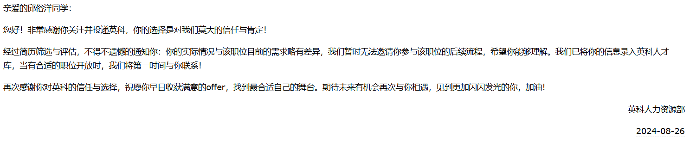
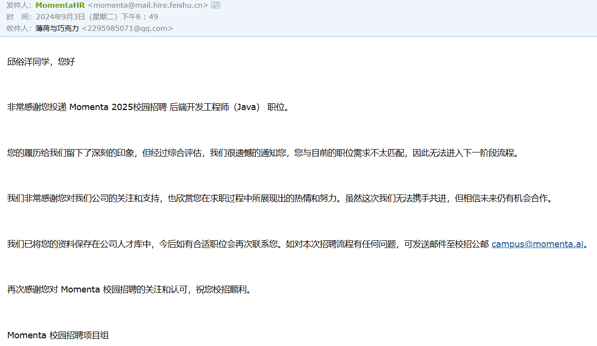
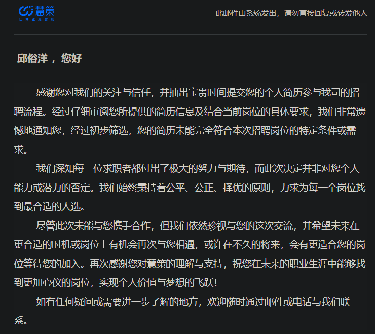

# 面试

作者：若木_
链接：https://ac.nowcoder.com/discuss/1354449?type=0&channel=-1&source_id=discuss_tag_discuss_hot_nctrack
来源：牛客网


## 1 背景

### 1.1为什么要认真准备自我介绍？

**1.** **必要性**：在求职面试中，一般来说同学和面试官打过招呼之后第一项就是自我介绍的环节。可能有的面试不会手撕代码，可能有的面试不会问八股，可能有的面试不会问项目，但**所有的面试都有自我介绍**，这是你**100%能压中的考点**

**2.****重要性****：**好的自我介绍不仅能给面试官留下初步的良好印象、展示自己的优势，更重要的是能够**引导和控制面试官在后续面试中会问你的问题**，从而提高问题**回答正确率、面试通过率**，在整场面试中掌握**主动权**

## 2 方案设计

### 2.1 设计原则

1.**简洁性**：人的注意力有限，因此自我介绍的内容**不能太啰嗦**，需要在较短的时间内**突出重点、突出优势**，尽量3分钟以内

2.**结构性**：为了突出重点、让面试官记住你想让他记住的东西，需要按照一定的结构设计自我介绍的内容（最简单的比如总分式）

### 2.2 自我介绍公式

**1.****核心公式**：开场句 + 名字 + 学校 + 届数 + 专业(可选) + 教育经历中的亮点(可选) + 实习经历(可选) + 实习中的项目/亮点(可选) + 开源经历(可选) + 自己做的项目(可选) + 竞赛等加分项(可选) + 结束句

2.**一个样例**：面试官您好，我叫xx，是xx大学xx届的毕业生，(我的专业是软件工程)。(在校期间我成绩优异，排名xx，获得xx奖学金)。(此外，我在xx公司实习过xx时间，是在xx部门做xx方向的业务，实习期间主要做了xx项目)。(另外，我还参加了xx开源社区，做了xx项目/解决了xx问题)。(另外，我还自己做了一个xx项目，背景是xx，用到了xx等技术)。(同时，我也参加过一些竞赛并且拿到了一些奖项，比如xx竞赛x等奖)。非常高兴能得到这次面试的机会，希望您接下来能多多指点，谢谢。

### 2.3 公式解读

下面针对上述公式中的重点和同学们可能有疑问的地方进行展开解读：

1.**学校**：没什么好说的，**最看重**，title越亮越好

2.**专业**：科班出身的同学们记得强调一下自己是科班出身的，这是**加分项**

3.**教育经历中的亮点**：在校期间成绩排名靠前/获得过奖学金的可以提一下，是**加分项**

4.**实习经历**：**第二看重**，仅次于学校，title越亮越好。需要说清楚做了什么业务和事情

5.**实习中的项目/亮点**：**第三看重**。有实习经历的同学一定要重点讲实习期间做的项目，这**比你自己做的项目重要得多**

6.**开源经历**：可选项，如果没有实习可以考虑，含金量不如实习（相当顶级的除外）

7.**自己做的项目**：烂大街，人人都有，想比别人牛就要**深挖项目**、自己做一些扩展和丰富（**有实习项目可以不写自己做的**）

8.**竞赛奖项**：可选项，有含金量的可以写上

## 3 埋钩子🪝

这一点很重要，所以单独来讲，我相信很多同学还不懂这个技巧

### 3.1 什么是埋钩子

字面上应该很好理解，做技术的同学相信也听说过hook等等，所以不多解释，埋钩子在本文的语境上指的是：

​    在自我介绍环节通过**强调和突出**等方式把你**比较擅长、或者是希望被问的部分**传达给面试官，在他心里埋下一个钩子，待到他在后续问你问题的时候想到了你介绍中的某些内容，从而提问。

### 3.2 为什么要埋钩子

读完3.1应该就很好理解了，埋钩子能让你有**一定的几率**控制面试官的提问方向，从而引导到你擅长回答的问题，从而讲的出彩，提高最终的面试**通过率。**

### **3.3 怎么埋钩子**

“既然是钩子，就要用饵，没有鱼会咬空钩。” ——若木

所以，如果你想让面试官来咬你的钩子，就要给他下饵，这里指的是：

1.**需要让面试官感兴趣**：面试也挺无聊的，如果你说的内容能提起面试官的兴趣，那么他后面来问的可能性就比较大（比如，你提到了你的项目中**亮点是xx、解决了xx难点**等）

2.**需要让面试官能问出好的问题**：面试官问你的问题也是需要仔细考虑的，需要能通过某些问题考察你的某方面能力和技能，所以一个聪明的做法是在介绍时提前埋下某些**可以提问的技术点**（比如**缓存一致性问题、消息队列可靠性问题**等）

## 4 总结

关于自我介绍，一定要提前准备和精心设计，并且要**写稿背下来**，不能每次都现场发挥。


# 投简历

谁给你的勇气投大厂的:rofl: 

### 1、英科再生



### 2、Momenta




### 3、惠策




# 面试题

## 笔试

### 1、反转列表

1. 

   

   ```java
   /*
    * public class ListNode {
    *   int val;
    *   ListNode next = null;
    *   public ListNode(int val) {
    *     this.val = val;
    *   }
    * }
    */
   ```

   <font title="blue">思路</font>：使用两个变量，其中一个变量用来存储前一个节点，一个变量用来临时存储下一个节点。使用循环遍历每个节点，直至下一个节点为null。每次更新临时节点。

   ```java
   public ListNode ReverseList (ListNode head) {
       // write code here
       ListNode temp2 = null;
       while(head !=null){
           ListNode temp1 = null ;
           temp1 = head.next;
           head.next = temp2;
           temp2 = head;
           head = temp1;
       }
       return temp2;
   }
   ```

   <font title="yellow">题解新思路</font>：

   1. 使用栈：遍历所有节点，使用栈存储每个节点，再依次出栈。

      ```java
      public ListNode ReverseList (ListNode head) {
          // write code here
          Stack<ListNode> stack = new Stack();
          if(head == null)
              return head;
          while(head.next!=null){
              stack.add(head);
              head = head.next;
          }
          ListNode res = head;
          while(!stack.empty()){
              head.next = stack.pop();
              head = head.next;
          }
          head.next = null;
      
          return res;
      }
      
      tips：
          栈的底层使用的是Vector来存储元素。使用synchronized确保线程安全。
      ```

   2. 双链表：多使用一个链表来存储。

      ```java
      public ListNode ReverseList (ListNode head) {
          // write code here
          ListNode newLink = null;
          while(head!=null){
              ListNode temp = new ListNode(head.val);
              temp.next = newLink;
              newLink = temp;
              head = head.next;
          }
      
          return newLink;
      }
      ```


# 底部

