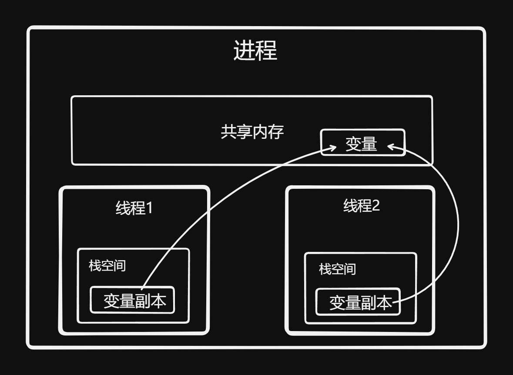
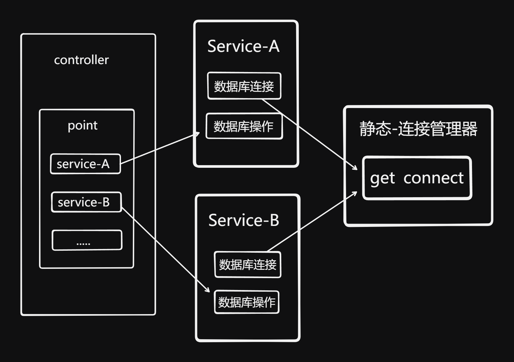
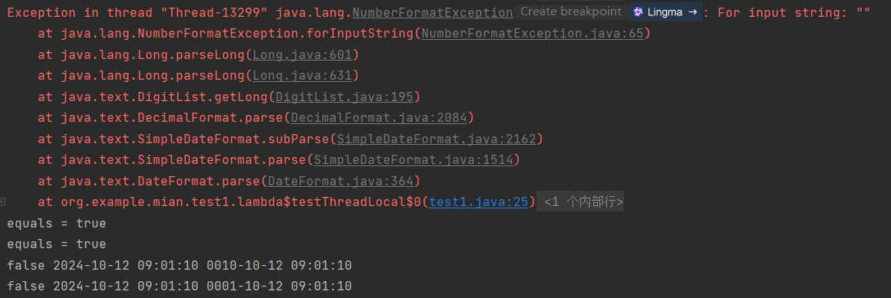
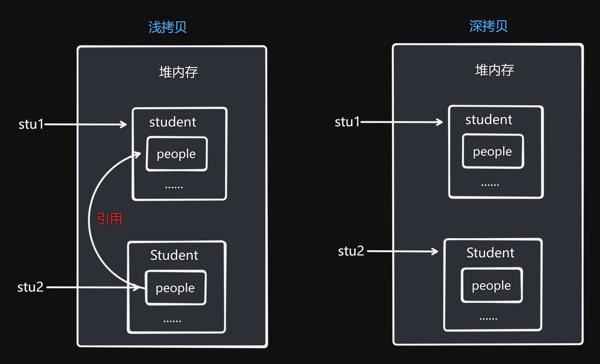

# 面试

作者：若木_
链接：https://ac.nowcoder.com/discuss/1354449?type=0&channel=-1&source_id=discuss_tag_discuss_hot_nctrack
来源：牛客网


## 1 背景

### 1.1为什么要认真准备自我介绍？

**1.** **必要性**：在求职面试中，一般来说同学和面试官打过招呼之后第一项就是自我介绍的环节。可能有的面试不会手撕代码，可能有的面试不会问八股，可能有的面试不会问项目，但**所有的面试都有自我介绍**，这是你**100%能压中的考点**

**2.****重要性****：**好的自我介绍不仅能给面试官留下初步的良好印象、展示自己的优势，更重要的是能够**引导和控制面试官在后续面试中会问你的问题**，从而提高问题**回答正确率、面试通过率**，在整场面试中掌握**主动权**

## 2 方案设计

### 2.1 设计原则

1.**简洁性**：人的注意力有限，因此自我介绍的内容**不能太啰嗦**，需要在较短的时间内**突出重点、突出优势**，尽量3分钟以内

2.**结构性**：为了突出重点、让面试官记住你想让他记住的东西，需要按照一定的结构设计自我介绍的内容（最简单的比如总分式）

### 2.2 自我介绍公式

**1.****核心公式**：开场句 + 名字 + 学校 + 届数 + 专业(可选) + 教育经历中的亮点(可选) + 实习经历(可选) + 实习中的项目/亮点(可选) + 开源经历(可选) + 自己做的项目(可选) + 竞赛等加分项(可选) + 结束句

2.**一个样例**：面试官您好，我叫xx，是xx大学xx届的毕业生，(我的专业是软件工程)。(在校期间我成绩优异，排名xx，获得xx奖学金)。(此外，我在xx公司实习过xx时间，是在xx部门做xx方向的业务，实习期间主要做了xx项目)。(另外，我还参加了xx开源社区，做了xx项目/解决了xx问题)。(另外，我还自己做了一个xx项目，背景是xx，用到了xx等技术)。(同时，我也参加过一些竞赛并且拿到了一些奖项，比如xx竞赛x等奖)。非常高兴能得到这次面试的机会，希望您接下来能多多指点，谢谢。

### 2.3 公式解读

下面针对上述公式中的重点和同学们可能有疑问的地方进行展开解读：

1.**学校**：没什么好说的，**最看重**，title越亮越好

2.**专业**：科班出身的同学们记得强调一下自己是科班出身的，这是**加分项**

3.**教育经历中的亮点**：在校期间成绩排名靠前/获得过奖学金的可以提一下，是**加分项**

4.**实习经历**：**第二看重**，仅次于学校，title越亮越好。需要说清楚做了什么业务和事情

5.**实习中的项目/亮点**：**第三看重**。有实习经历的同学一定要重点讲实习期间做的项目，这**比你自己做的项目重要得多**

6.**开源经历**：可选项，如果没有实习可以考虑，含金量不如实习（相当顶级的除外）

7.**自己做的项目**：烂大街，人人都有，想比别人牛就要**深挖项目**、自己做一些扩展和丰富（**有实习项目可以不写自己做的**）

8.**竞赛奖项**：可选项，有含金量的可以写上

## 3 埋钩子🪝

这一点很重要，所以单独来讲，我相信很多同学还不懂这个技巧

### 3.1 什么是埋钩子

字面上应该很好理解，做技术的同学相信也听说过hook等等，所以不多解释，埋钩子在本文的语境上指的是：

​    在自我介绍环节通过**强调和突出**等方式把你**比较擅长、或者是希望被问的部分**传达给面试官，在他心里埋下一个钩子，待到他在后续问你问题的时候想到了你介绍中的某些内容，从而提问。

### 3.2 为什么要埋钩子

读完3.1应该就很好理解了，埋钩子能让你有**一定的几率**控制面试官的提问方向，从而引导到你擅长回答的问题，从而讲的出彩，提高最终的面试**通过率。**

### **3.3 怎么埋钩子**

“既然是钩子，就要用饵，没有鱼会咬空钩。” ——若木

所以，如果你想让面试官来咬你的钩子，就要给他下饵，这里指的是：

1.**需要让面试官感兴趣**：面试也挺无聊的，如果你说的内容能提起面试官的兴趣，那么他后面来问的可能性就比较大（比如，你提到了你的项目中**亮点是xx、解决了xx难点**等）

2.**需要让面试官能问出好的问题**：面试官问你的问题也是需要仔细考虑的，需要能通过某些问题考察你的某方面能力和技能，所以一个聪明的做法是在介绍时提前埋下某些**可以提问的技术点**（比如**缓存一致性问题、消息队列可靠性问题**等）

## 4 总结

关于自我介绍，一定要提前准备和精心设计，并且要**写稿背下来**，不能每次都现场发挥。


## 稿子

 各位面试官好，我的名字叫邱俗洋。就读于北华航天工业学院。在大二时，我进入任课老师的实验室，边学习边完成老师分发的项目；在校期间，获得过校奖学金和一些竞赛奖项如十三届的蓝桥杯三等奖、校it科技节软件开发一等奖等。目前在亚信科技（中国）有限公司实习，实习的岗位是后端开发。主要的实习内容是进行网管系统部分模块的更新迭代。最后，非常高兴能够参加本次面试。


# 面试题

## 笔试

### 1、反转列表

1. 

   

   ```java
   /*
    * public class ListNode {
    *   int val;
    *   ListNode next = null;
    *   public ListNode(int val) {
    *     this.val = val;
    *   }
    * }
    */
   ```

   <font title="blue">思路</font>：使用两个变量，其中一个变量用来存储前一个节点，一个变量用来临时存储下一个节点。使用循环遍历每个节点，直至下一个节点为null。每次更新临时节点。

   ```java
   public ListNode ReverseList (ListNode head) {
       // write code here
       ListNode temp2 = null;
       while(head !=null){
           ListNode temp1 = null ;
           temp1 = head.next;
           head.next = temp2;
           temp2 = head;
           head = temp1;
       }
       return temp2;
   }
   ```

   <font title="yellow">题解新思路</font>：

   1. 使用栈：遍历所有节点，使用栈存储每个节点，再依次出栈。

      ```java
      public ListNode ReverseList (ListNode head) {
          // write code here
          Stack<ListNode> stack = new Stack();
          if(head == null)
              return head;
          while(head.next!=null){
              stack.add(head);
              head = head.next;
          }
          ListNode res = head;
          while(!stack.empty()){
              head.next = stack.pop();
              head = head.next;
          }
          head.next = null;
      
          return res;
      }
      
      tips：
          栈的底层使用的是Vector来存储元素。使用synchronized确保线程安全。
      ```

   2. 双链表：多使用一个链表来存储。

      ```java
      public ListNode ReverseList (ListNode head) {
          // write code here
          ListNode newLink = null;
          while(head!=null){
              ListNode temp = new ListNode(head.val);
              temp.next = newLink;
              newLink = temp;
              head = head.next;
          }
      
          return newLink;
      }
      ```


### 百度

##### 1、kmp算法匹配


### 数字马力（其他）

1.说一下final关键字了解多少

2.一个实体对象我把它设置成final，他里面的属性可以修改吗？

3.关于static关键字了解多少，有哪些应用（静态代码快等）

4.i++和++i的差别

5.HashMap原理，它里面的key和value可以为空值吗

6.项目中哪些涉及并发

7.线程池

8.你的tomcat是200因为它本身有这个限制，如果其他场景不考虑限制，你的线程数应该如何设定？IO密集型，计算密集型

9.线程池它是怎样实现线程复用的原理是啥

10.除了默认拒绝策略，其他策略有了解吗，有什么优劣呢

11.并发编程有没有用过synchronized，volatile，lock接口这些吗，具体怎么用的，使用场景上的差异，优劣

12.某段代码会不会因为cpu做了指令优化导致代码运行结果不一样呢

13.volatile是怎样操作它的值是对所有线程可见的呢，他在内存里面存储和其他普通变量有什么差异

14.lock和synchronized在实际的应用有什么差异，比如他俩各修饰一段代码快

15.公平锁和非公平锁的差异体现在哪？是基于什么实现的或者说你对aqs了解多少

16.wait和sleep有什么差异

17.对于类加载和双亲委派模型那些核心的用到的讲一下

18.如何打破双亲委派模型，双亲委派的设计的好处在哪

19.比如说jdk里面已经有了一个Object类的实现了。我现在手写一个Object然后我再编译打包放到具体的目录下，这时候他加载的是JDK自带的还是我自己手写的，还是会编译失败

20.怎样去打破双亲委派模型呢比如说我想用Bootstrap我想加载应用代码，我怎样去实现呢

21.你有没有接触过Thread ContextLoader这个类加载

22.常用的垃圾收集器有哪些23.常见的垃圾回收算法有哪些

24.可达性分析的GC Root是怎么确定的

25.现在又这样一个场景，一个父类一个子类，我在父类里面定义一个常量字符串，我在子类里面写了一个main函数去打印这个字符串，父类会被加载吗？

26.关于设计模式，比如动态代理吧有哪些比较典型的应用场景

27.动态代理InvocationHandler有个invoke方法他里面有三个参数你知道是哪三个吗，分别作什么用

28.那他第一个参数在整个反射调用过程中有什么用呢？它会用到吗？

29.代理类是怎么生成的你能跟我说一下嘛，比如包括名字，字节码这些

30.你在开发中用过动态代理吗？

31.springboot的启动流程，核心注解说几个常用的，还有和自动装配有关的呢

32.spring是怎么解决循环依赖的

33.提到三级缓存，可以展开说一下嘛

34.在做springboot的时候。比如控制器你的异常处理是怎么做的

35.有没有用过AOP实现的异常的捕捉和异常的处理

36.你说一下B树和B+树的区别，比如他们的应用场景，数据结构

37.聚簇索引了解吗

38.用这一列作为聚簇索引，它有什么要求吗，怎样做到效率最高

39.两个表其他都是一样的，只有主键不一样，其中一个是自增的。一个是uuid，他们，他们的查询速度有什么差异吗，为什么会有这种差异呢，它使用写的话速度有什么影响吗

40.事务的特性

41.事务之间隔离是基于什么实现的

42.MVCC你了解吗具体说说过程讲解

43.评论和点赞都是在redis中存储的呢？

44.你这个评论和点赞是只有登录的用户能点赞还是说游客也能操作

45.我想以游客的身份去点赞，你想过这些数据怎么保存呢？

46.有一个游客我去刷点赞，你要怎样去防御呢，具体怎么实施

47.评论点赞是会记录哪个用户操作的，那么我想按照点赞数去排序，你有支持这个功能吗？就是一个视频有多人观看，然后会留下评论，关于这个评论的点赞，你评论的点赞展示的时候是随机显示还是按照一定的顺序去展示（如果你评论是存在数据里面的）

48.redis里面你的zet怎样去设计这个key去存储

49.你的私信是基于什么实现的

50.我现在想考虑实时的让对方接受，类似QQ这种，你有考虑过这种实现吗

51.ZSET的底层数据结构是基于啥实现的，你知道跳表这个结构吗，常用的数据结构有哪些

52.布隆过滤器有了解过吗，有用过吗

53.比如说我通过上游来个一个查询，我经过布隆过滤器返回数据，布隆过滤器告诉你有这个数据，那么他真实的是什么样的呢是真实有这个数据吗

54.RabbitMq里面的交换机有几种？

55.他怎么去保证我发送这个消息，上游怎么知道他发送成功了，并且被成功消费了56.你有没有了解过RabbitMq事务？

57.你这个项目不同的用户的用户权限你是怎样设定的，权限比如管理员可以查看所有的后台数据访问某些页面，那么角色和权限的对应关系你是怎么做的

58.视频审核，某个用户新提交个视频会生成一个审核任务，审核通过后才可能对用户可见，你能说一下这个某一个用户上传视频之后，怎么生成视频任务，任务执行完之后它又怎么去反向影响到这个事情的状态，让他变成对所有人都可见，你是怎么做的

59.Redis事务有用到过吗

60.Tomcat给我说一下这个项目整体是怎样设计的，有几个核心模块，每个模块的功能

61.关于Tomcat的连接器Connector的工作模式有哪些，你用的是哪些呢

62.NIO有了解吗63.Tomcat里面核心架构核心模块

64.有没有做过Tomcat协议优化65.比如你在你自己的服务器上运行Tomcat跑着跑着内存溢出了。你有想法吗，怎么去排查

# 百度

1、


# 知识点

## 算法

### 1、kmp算法


## 多线程

### 1、Volatile关键字

`场景`：若在一个进程中有一个变量，在该进程创建两个线程。其中一个线程是修改该变量，另一个线程是判断该变量是否修改；有可能会发生变量修改后检查变量修改的线程感知不到。这是由于在创建线程时，为了减少性能的消耗，线程中会有存放变量的副本，即复制变量。减少频繁使用cpu资源。在获取变量时，会获得副本的值。使用了该关键字后就直接访问变量，而不是使用副本。尽量使用synchronized或lock手动上锁。



确保变量的线程可见性。如有两个线程，一个是修改变量，另一个是获取这个变量是否改变；如果不添加volatile关键字，则可能对这个变量的读取会有延迟或者不可读。

原因是：不添加关键字的话，线程只会读取该块内存的值，而不会进行该值的更新。会有滞后性。添加关键字后，只要获取该变量，都会从主内存中拿出最新值。

但是不添加关键字的话，jvm也会确保变量会尽量确保变量有可见性，所以可能也能执行。

经过验证，使用测试代码还是能够正常读取到对应变量的最新值。只能说有可能会读取不到最新值

不可以确保变量的原子性操作。因为该关键字只是确保了变量的可见性，并没有加锁。需要使用synchronized或者lock。


### 2、ThreadLocal

ThreadLocal即线程的本地变量，在每个变量中都创建一个副本，就是这个变量每次都会在线程中创建，实现数据隔离。

<font title="red">问题</font>：那和在线程中再创建变量有什么区别呢？

<font title="blue">解答</font>：临时变量只能在本方法中使用。ThreadLocal可以跨类、跨方法使用。省去了参数传递的麻烦。如图：在控制器中有一个接口，其中需要连接数据库并操作。如果每次service都创建一个连接的话，就需要很多次连接。而使用ThreadLocal的话，无需在控制器中进行连接，并传递连接信息。只需要在一个连接管理器中使用ThreadLocal变量，每次获取的都是该线程的连接信息。




验证：由于simpledateformate是线程不安全的，故使用该类来进行验证。

 首先验证该类是线程不安全的。多个线程使用同一个simpledateformate来进行格式化日期。结果如图二，截取部分错误。发现可能会出现时间错误。如图会遇到格式化错误，因为都在使用这个变量，多线程修改读取就会导致格式错误。

```java
SimpleDateFormat f = new SimpleDateFormat("yyyy-MM-dd HH:mm:ss");
while(true){
    new Thread( ()->{
        String dataStr = f.format(new Date());
        try{
            Date parsedData = f.parse(dataStr);
            String temp = f.format(parsedData);
            boolean equals = dataStr.equals(temp);
            if(!equals){
                System.out.println(equals + " " + dataStr + " " + temp);
            }else{
                System.out.println("equals = " + equals);
            }
        }catch (ParseException e){
            e.printStackTrace();
        }
    }).start();
}
```



使用ThreadLocal来解决这个问题：

```java
ThreadLocal<SimpleDateFormat> local =ThreadLocal.withInitial(()-> new SimpleDateFormat("yyyy-MM-dd HH:mm:ss"));
while(true){
    new Thread( ()->{
        String dataStr = local.get().format(new Date());
        try{
            Date parsedData = local.get().parse(dataStr);
            String temp = local.get().format(parsedData);
            boolean equals = dataStr.equals(temp);
            if(!equals){
                System.out.println(equals + " " + dataStr + " " + temp);
            }else{
                System.out.println("equals = " + equals);
            }
        }catch (ParseException e){
            e.printStackTrace();
        }
    }).start();
}
```


## Java基础

### 1、字符字节流

Stream是字节流、Reader是字符流。

字节流按字节处理，需要转换。

字符流可以直接读取出字符。


### 2、hashmap

1. 容量设置：如果构造函数传入的容量大小不是2的幂，则会进行操作，将容量设置为大于该值的2的幂。 操作：通过右移位运算，再将结果与得到的容量值进行或运算，得到相应值。
2. capacity数组的容量，即数组的大小。载荷因子*capacity就是临界值，当数组的个数即“桶”大于等于这个值时，进行扩容。


### 3、Object

#### 1、hashCode()

获取该对象的哈希值，这个哈希值是根据jdk的默认方法`Marsaglia's xor_shift`随机数生成的，可在启动参数中设置共计6种不同的默认方法（-XX:hashCode=4)；

如果重写一个对象的equals方法，则必须重写其hashCode。原因是有的集合如：HashMap是根据该对象的哈希值来判断其存放的位置。


### 4、String(Buffer)(Builder)

#### String

- String底层使用的是数组，8使用的是char，而9后面改为Byte，原因是更节省空间；

- String有一个方法是intern。其作用是返回常量池的对象引用，而不是栈对象的引用。

- 在使用+拼接字符串时，会编译成创建一个Builder调用appendd方法来拼接。如果在循环内进行拼接，会循环创建Builder。推荐手动创建Builder；
- Builder推荐在单线程中使用，多线程使用Buffer。因为Builder是使用引用的方式来对字符串进行操作，并且没有添加锁🔒。而Buffer添加锁🔒来控制。
- String的值存放在常量池中，如果将相同值赋值给一个新对象，那么这两个对象引用的是常量池中的同一个对象。但还是会创建出对象。


### 其他

#### 1、抽象类和接口

java8的接口可以有static和default方法：static使用的少，一般是接口的工具方法；default是方法的默认实现，不重写就默认实现。在java9接口开始就有private方法，但只能在default方法调用。


#### 2、深拷贝和浅拷贝

两个区别就在于拷贝的对象中的对象是进行了拷贝还是只复制了引用。

拷贝需要实现*Cloneable*接口。浅拷贝是指☞复制一个对象的属性到另一个对象上，如果对象中有其他的对象，则只复制引用。即内存地址；深拷贝是指☞在浅拷贝的基础上，复制属性对象的值，而不是简单的复制属性对象的引用。即深拷贝的话，使用==符号判断两个属性是否相等时，会是false。如果是浅拷贝则是true；要实现深拷贝，就必须让属性对象也进行一次clone。并赋值给拷贝出来的对象。还有一个是引用拷贝，直接就是使用=符号。




## 其他

### 1、CSRF攻击

黑客伪装成受信任的用户去请求受信任的网站。


# 面试

## 1、北京万智信达智能科技（实习）

操作失误，导致声音没录上。

:one: 、在亚信实习期间都做了什么？

：负责亚信网管系统的更新迭代，主要负责作业管理、用户管理、路由注册和`网络可视化`模块的开发。

:two: 、有没有比较复杂的开发问题？

：在之前的系统`有一个后台采集计划执行的方法，其中需要读取设备解析出数据后需要通过访问第三方服务来获取这些数据的归属者。之前系统`使用的是单线程的操作，但是太耗时了，大概1分钟处理30条左右的数据。现在给他改成用线程池实现多线程进行处理。

:three: 、具体的代码是怎么实现的？

：使用信号量和线程池，还有一个线程计数器。`信号量的大小设置为线程池队列的大小，因为数据多，会导致内存占用过多`，其中这个线程池的最大线程数量和队列最大数量可以通过配置文件配置，`或者使用默认值`，操作就是循环遍历每条数据，在每次迭代的时候`在当前线程`申请一个信号量，并创建一个线程。在线程执行完毕后会释放一个信号量，并让线程计数器减一。最后等待所有的线程执行完毕。

:four: 、除了这个功能，还开发了什么？

：还有就是作业管理模块，可以批量进行上传作业设置。`使用execl读取工具：`是通过用户上传`特定格式的`excel，读取这个excel文件来获取的。然后进行解析获取的作业。

:five: 、excel在读取的时候，行号和列号是从1开始排还是0开始排？

：我记得是从0开始排。然后当时在读取的时候还遇到了个问题，就是读取的时候可能会读到空白行，导致格式读取错误。

:six: 、如何解决的空白行问题？

：读取的时候让第一列作为唯一id`(因为第一行是必须填写的字段)`，然后在读到行第一列的值是空的时候，就认为这个文件到此为止。`如果第一列有填，其他必须填的字段没有的话就提示用户格式错误`

:seven: 、在处理excel的时候，如果前4行是表头的话，该怎么读取？

：如果是从第4行开始的话，让读取的下标直接从4开始，前面几行就舍弃不进行读取。

:eight: 、还有没有做过别的？

：其他比较复杂的就没做过了，主要都是和前端联调，对一些数据的查询和修改等操作。

:nine: 、数据库用的啥数据库？

：用的mysql，之前的系统用的是oracle，现在移植到mysql。

:keycap_ten: 、移植是你参与做的吗？

：没有，我就只把部分数据迁移了过来。

:a: 、为什么在那边实习现在又不实习了？

：主要是现在的企业很多都在用微服务那些的，亚信这里虽然也有用到，但是没感觉，比如微服务之间也没有互相调用什么的。感觉用的很少。

:b: 、那你想做哪方面啊？

：比如微服务那些服务调用之类的。？？


# 底部

