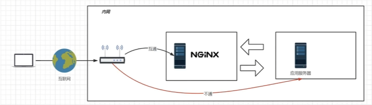

# ssh

```
// 创建一个rsa的ssh。全程回车。随后向远程仓库添加公钥即可
ssh-keygen -t rsa -C "2295985071@qq.com"

-> Enter file in which to save the key (一个文件目录.ssh/id_rsa): # 这里需要回车，是告诉你创建在哪个目录，方便你去找。
-> Enter passphrase (empty for no passphrase): # 这里让你配置密码短语，最好不要配置，不然每次push的时候还是需要输入这个。
#  如果你更注重安全就配置，但是我们这里为了方便不配置，不配置直接回车就行。
-> Enter same passphrase again: # 确认下密码短语，没配置了话，继续回车就行。
-> Your identification has been saved in 一个文件目录.ssh/id_rsa # 这就是创建成功了，这个 id_rsa就是私钥的路径
-> Your public key has been saved in 一个文件目录.ssh/id_rsa.pub # .pub的就是公钥，都在一个文件夹
```


---


# nginx

openresety : http://openresty.org	

tengine：http://tengine.taobao.org

```
目录结构：
conf	// 存放配置文件
html	// 默认情况下静态网页
logs	// 日志
```

## 配置文件：

```shell
worker_processes 1;					// 子进程进程数
events{
	worker_connections 1024;		// 每一个进程接收连接数目
}

http{
	include	mime.types;				// 把别的配置引入;mime.types是类型与后缀对应表
	default_type application/octet-stream		// 默认类型为数据流，即下载
	
	sendfile	on;					// 零拷贝
	keepalive_timeout	65;			// 保持连接超时事件
	
	
	
	# 静态页面
	server{							// 一个server表示一个虚拟主机
		listen 80;					// 监听端口
		server_name localhost;		// 主机的主机名，可以写域名、主机名、ip
		location / {				// url
			proxy_pass http://bilibili.com		// 反向代理，若配置则下面的无效
			proxy_pass http://hppds				// 反向代理负载均衡
			
			root html;				// 绝对/相对路径,相对于nginx的html目录
			index index.html		// 默认页
		}
	
		error_page 500 502 503 /50x.html;	// 若发生前面500等的错误，跳到/50x.html页面
		location /50x.html{					// 设置/50.html页面的目录
			root html
		}
	}
	
	# 反向代理+负载均衡
	upstream httpds{				// 服务器群别名，用于负载均衡
		# weight 是权重，表示负载均衡的轮询次数比例。但轮询无法保持会话0
		server 192.168.44.1:8080 weight=8;
		server 192.168.44.2:8080 weight=2 backup;	# 正常不使用，其他服务器没法使用时，在使用
		server 192.168.44.3:8080 weight=1 down;		# down表示不参与负载均衡
	}
	
	server{							// 一个server表示一个虚拟主机
		listen 80;					// 监听端口
		server_name localhost;		// 主机的主机名，可以写域名、主机名、ip
		location / {				// url
			# proxy_pass http://bilibili.com		// 反向代理
			proxy_pass http://hppds				// 反向代理负载均衡，httpds可以自定义，使用upstream设置服务器群
		}
	
		error_page 500 502 503 /50x.html;	// 若发生前面500等的错误，跳到/50x.html页面
		location /50x.html{					// 设置/50.html页面的目录
			root html
		}
	}
	
	# 静态分离
	server{							// 一个server表示一个虚拟主机
		listen 80;					// 监听端口
		server_name localhost;		// 主机的主机名，可以写域名、主机名、ip
		location / {				// url
			proxy_pass http://bilibili.com		// 反向代理，若配置则下面的无效
		}
	
		# 分离，引用nginx服务器本地文件
		location ~*(js|css|img) {		// 使用正则表达式，~是正则的开始，*是无视大小写。
			root html;
			index index.html;
		}
	
		error_page 500 502 503 /50x.html;	// 若发生前面500等的错误，跳到/50x.html页面
		location /50x.html{					// 设置/50.html页面的目录
			root html
		}
	}
	
	# URL rewrite
	server{							// 一个server表示一个虚拟主机
		listen 80;					// 监听端口
		server_name localhost;		// 主机的主机名，可以写域名、主机名、ip
		location / {				// url
			# 使用正则表达式，将原来的网址/index.html?pageNum=数字 改为 数字.html
			rewrite ^/([0-9]+).html&	/index.html?pageNum=$1	break;	
			proxy_pass http://bilibili.com		// 反向代理，若配置则下面的无效
		}

	
		error_page 500 502 503 /50x.html;	// 若发生前面500等的错误，跳到/50x.html页面
		location /50x.html{					// 设置/50.html页面的目录
			root html
		}
	}
	
	# 防盗链
	server{							// 一个server表示一个虚拟主机
		listen 80;					// 监听端口
		server_name localhost;		// 主机的主机名，可以写域名、主机名、ip
		location / {				// url
			proxy_pass http://bilibili.com		// 反向代理，若配置则下面的无效
		}
	
		location ~*(js|css|img) {		// 使用正则表达式，~是正则的开始，*是无视大小写。
			# 防盗链 只允许ip或不带referer访问，其他返回403；ip建议用域名
			# 直接使用链接访问就不带referer，或者使用工具下载
			valid_referers ip none;
			if($invalid_referer){
				# 若盗链图片，可以直接返回图片；就不需要return
				# rewrite ^/ 	/img/x.png	break;		
				
				return 403; 
			}
			root html;
			index index.html;
		}
		# 错误页面
		error_page 403 /40x.html;
		
		error_page 500 502 503 /50x.html;	// 若发生前面500等的错误，跳到/50x.html页面
		location /50x.html{					// 设置/50.html页面的目录
			root html
		}
	}
	
	
	
}
```

## 反向代理

用户发请求时，通过反向代理服务器，应用服务器返回数据时，跳过反向代理服务器，直接到外网。但是应用服务器需要连接到外网，但是不能直接接收请求。



```
server{
	listen 80
	server_name localhost		// 随便起，或者可以配置成域名，配置成域名时，若监听的端口一致，则根据域名来进行选择
	
	location / {				// 静态页面，root为目录，index为首页
		root /home/h5;
		index index.html	
	}
	
}
```


---


# frp内网穿透

## 前提准备

云服务器一台，可选择云服务器、轻量型服务器、vps。

## 开始

在服务器中下载对应的 ==frp== 版本。：[frp github](https://github.com/fatedier/frp)

这里以0.53.2为例

### 1、服务器

下载好后，直接运行下面这个shell文件即可。会在运行目录下生成一个 ${dirname} 变量的目录。

若要修改下载的 frp 版本，需修改第 4、5行的对应frp版本号。

若要修改服务器监听端口，修改40行的对应值。

```shell
#!/bin/bash

# 下载资源的URL
version="0.53.2"
name="frp_0.53.2_linux_amd64.tar.gz"
dirname=$(basename "$name" .tar.gz)
url="https://github.com/fatedier/frp/releases/download/v${version}/${name}"

echo $url

if ls *frp* 1> /dev/null 2>&1; then
    echo "文件存在"
else
    echo "文件不存在"
     # 下载资源
    wget --timeout=600 --quiet --show-progress "$url"
    # 检查wget的返回码
    if [ $? -eq 0 ]; then
        echo "下载完成"
        # 解压文件
    else
        echo "下载失败"
        exit
        # 在这里可以添加下载失败后的处理逻辑
    fi
fi

if [ -d "$dirname" ]; then
    echo "目录存在"
else
    echo "目录不存在"
    tar -zxf "$name"
fi

cd "$dirname"
rm -rf frpc frpc.toml
# bindPort 是云服务器监听的端口，需开放
# vhostHTTPPort 是对外http服务的端口，vhostHTTPSPort 同理。若不需要http或https，可去掉这两行
echo "" > frps.toml
echo -e "bindPort=7000\nvhostHTTPPort=80\nvhostHTTPSPort=443\n" > frps.toml
nohup ./frps -c frps.toml &
sleep 1
pid=$(pgrep -f "frps")
if [ -z "$pid" ]; then
    echo "frps服务未启动，请自行启动"
else
    echo "frps进程pid的值为 $pid"
    rm -f frps-pid*
    touch "frps-pid-${pid}"
fi
```

### 2、内网主机

最好下载与服务器对应版本的 frp。

下载对应系统版本的 frp。

#### windows版本

解压出来后，进入frpc.exe所在目录，可以创建一个文件bat。执行下面命令

其中第8行的xxx需要修改为对应的云服务器的公网ip

第24行中的xx.domin.xx需要修改为对应域名，ip或许可以。

```
@echo off
set filename=frpc.toml
del frps
del frps.toml

touch e.txt
(
echo serverAddr = "xxx.xxx.xxx.xxx" 
echo serverPort = 7000

echo # ssh连接
echo [[proxies]]
echo name = "ssh"
echo type = "tcp"
echo localIP = "127.0.0.1"
echo localPort = 22
echo remotePort = 6000

echo  # http服务
echo [[proxies]]
echo name = "web"
echo type = "http"
echo localPort = 80
echo customDomains = ["xxx.domin.xxx"]
) > frpc.toml
./frpc -c frpc.toml
```

#### linux版本

直接在压缩包目录中执行这个bash文件。

需要修改版本：version和name中对应版本的字段。

需要修改服务：修改39行起的字段。

```shell
#!/bin/bash

# 下载资源的URL
version="0.53.2"
name="frp_0.53.2_linux_amd64.tar.gz"
dirname=$(basename "$name" .tar.gz)
url="https://github.com/fatedier/frp/releases/download/v${version}/${name}${back}"

echo $url

if ls *frp* 1> /dev/null 2>&1; then
    echo "文件存在"
else
    echo "文件不存在"
     # 下载资源
    wget --timeout=600 --quiet --show-progress "$url"
    # 检查wget的返回码
    if [ $? -eq 0 ]; then
        echo "下载完成"
        # 解压文件
    else
        echo "下载失败"
        exit
        # 在这里可以添加下载失败后的处理逻辑
    fi
fi

if [ -d "$dirname" ]; then
    echo "目录存在"
else
    echo "目录不存在"
    tar -zxf "$name"
fi

cd "$dirname"
rm -rf frps frps.toml
# bindPort 是云服务器监听的端口，需开放
# vhostHTTPPort 是对外http服务的端口，vhostHTTPSPort 同理。若不需要http或https，可去掉这两行
echo "" > frpc.toml
echo  'serverAddr = "123.58.220.74"
serverPort = 7000
# ssh连接
[[proxies]]
name = "ssh"
type = "tcp"
localIP = "127.0.0.1"
localPort = 22
remotePort = 6000

# http服务
[[proxies]]
name = "web"
type = "http"
localPort = 80
customDomains = ["www.boheqiaokeli.com"]
' > frpc.toml
nohup ./frpc -c frpc.toml &
sleep 1
pid=$(pgrep -f "frpc")
if [ -z "$pid" ]; then
    echo "frpc服务未启动，请自行启动"
else
    echo "frpc进程pid的值为 $pid"
    rm -f frpc-pid*
    touch "frpc-pid-${pid}"
fi
```


# jdk

## 下载 jdk11

下载jdk11的tar.gz压缩包并上传服务器，如

```
tar -zxvf openjdk-11+28_linux-x64_bin.tar.gz
--> jdk-11

// 创建目录，并创建一个软链接指向这个目录，方便以后改变jdk版本
mkdir /usr/local/java
mv jdk-11 /usr/local/java
ln -s jdk-11 jdk

// 添加环境变量，在文件的最后加上。
vim /etc/profile
export JAVA_HOME=/usr/local/java/jdk
export PATH=$JAVA_HOME/bin:$PATH
// 应用配置
source /etc/profile
```


# 问题：

## 数据库

### 无密码

<font title="red">问题描述</font>：在安装8.x版本的时候，会遇到无需密码就能登录，但是使用了网上的很多方法都没法解决。

<font title="blue">解决办法</font>：查看登录验证方式：

```
use mysql;
SELECT user, plugin FROM mysql.user;
```

​	若root的验证方式是 ==auth_socket== 表示root用户使用套接字身份验证，而不是密码验证；需进行修改。

​	下列代码将 ==新密码== 修改为需要设置的密码。若需要远程登录root用户，可以使用第三行命令。

```
ALTER USER 'root'@'localhost' IDENTIFIED WITH mysql_native_password BY 'Admin123';
// 运行远程登录root用户，可选
update user set host = '%' where user = 'root';
GRANT ALL PRIVILEGES ON *.* TO 'root'@'%' WITH GRANT OPTION;

FLUSH PRIVILEGES;
```

 


# 底部
